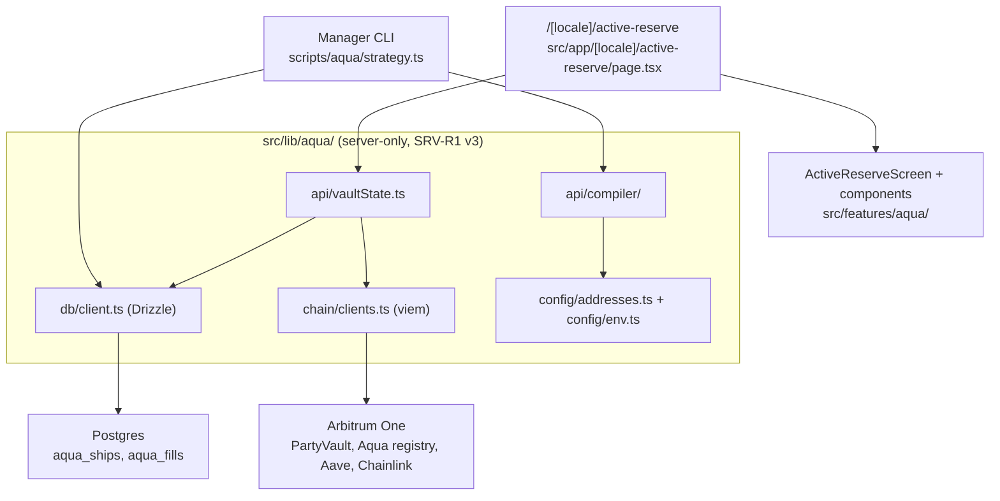

# Active Reserve, implementation plan (frontend and server)

- `@id` PP-AQUA-DOC-001
- `@name` Active Reserve implementation plan (frontend and server)
- `@implements-rules-version` v3
- `@hackathon` POO-1057 (1inch Aqua / SwapVM), Active Reserve
- **Repository:** `pool-party-v2-frontend`, branch `feat/aqua-poo-1067-investor-page`
- **Companion repository (on-chain):** [github.com/0xmvercosa/pool-party-aqua](https://github.com/0xmvercosa/pool-party-aqua)

> **For hackathon evaluators.** This is the plan of record for the **frontend and server half** of the
> entry. The contracts, the deploy and ops scripts, the taker and the judge package live in the public
> companion repository linked above. Our issue tracker is private, so every issue this half ran is
> mirrored here with what it shipped and which files carry it. Every claim below resolves to a path in
> this tree, an address on Arbitrum, a transaction hash, or an upstream link.
>
> **This is not the only hackathon in this repository.** [`docs/_hackathon/`](../_hackathon/00_IMPLEMENTATION_PLAN.md)
> belongs to a **different, separate entry** (Universal Funding, built on the Uniswap Trading API,
> epic POO-1022). The two share a codebase and nothing else: different epic, different rail,
> different submission. Do not read one as context for the other.

---

## 1. What this half is, and where the other half lives

**Active Reserve** is an always-earning USDC reserve that buys ETH below market. The official product
description, used verbatim on the page, in the catalog and in the submission:

> An always-earning reserve that buys the dip. Capital earns Aave lending yield every block and is
> deployed automatically the instant the market dips into the manager's buy band, purchasing ETH below
> market price. Objective: accumulate ETH at a discount while never sitting idle.

About 95% of vault USDC sits in Aave behind a 5% hot buffer. A sleeve worth about 10% of TVL is
registered with Aqua as virtual balance, so the same capital is earning and quotable at once. When a
fill lands larger than the hot buffer, the maker hook withdraws from Aave **inside the settlement
transaction**. That just-in-time withdrawal is the mechanism the whole entry is built around.

### Division of labour

**The companion repo owns everything that is deployed and everything that signs. This repo owns
everything that compiles, records and displays.**

| Concern | Track A: `pool-party-aqua` (public) | Track B: this repo |
|---|---|---|
| Contracts | `PartyVault`, `AaveV3Adapter`, both source-verified on Arbiscan | reads them through committed ABI artifacts, never deploys |
| Program bytes | `scripts/build-orders.ts` mints the launch payloads | `src/lib/aqua/api/compiler/` is the second producer, byte-identical by test |
| Signing | manager wallet, taker bot | never signs: emits `BuiltTx` payloads for a human wallet (SRV-R5) |
| Canonical facts | `docs/VERIFIED.md` (addresses, measured on-chain evidence) | `src/lib/aqua/config/addresses.ts` mirrors it |
| Business rules | `docs/01_BUSINESS_RULES.md` | implements them, each refusal names its rule |
| Persistence | none | `aqua_ships`, `aqua_fills` on Postgres via Drizzle |
| Investor surface | none | `/[locale]/active-reserve`, server-rendered, read live |

### The addresses this half is pinned to

Every value below is mirrored in `src/lib/aqua/config/addresses.ts` and carries its evidence in
Track A's `docs/VERIFIED.md`. Chain: **Arbitrum One (42161)**.

| Role | Address |
|---|---|
| PartyVault (maker) | `0xec870a6A9E8EE41B349FD0766b8f295D6EDC6610` |
| AaveV3Adapter (carry leg) | `0x6d409fF8578D017AddDB2e9Ad0848D8F0A65aBAe` |
| Manager | `0xc365B6795443380eb76516dA0Cedd5a00B349d66` |
| Taker | `0x67Fd51e5082205AF0bD97039a6124Ff3368aD0da` |
| **1inch Aqua registry (gen 2, unmodified)** | `0x1111113CCf1426A8E30e2bfF5E005d929bF6a90a` |
| **1inch AquaSwapVMRouter (gen 2, unmodified)** | `0x1111113Db0e0ef9D0E3A50d5f094a3a57a26C0DE` |
| Aave v3 Pool | `0x794a61358D6845594F94dc1DB02A252b5b4814aD` |
| aUSDC | `0x724dc807b04555b71ed48a6896b6F41593b8C637` |
| Chainlink ETH/USD (8dp) | `0x639Fe6ab55C921f74e7fac1ee960C0B6293ba612` |
| USDC (native, not USDC.e) | `0xaf88d065e77c8cC2239327C5EDb3A432268e5831` |
| WETH | `0x82aF49447D8a07e3bd95BD0d56f35241523fBab1` |

A **dead gen-1 deployment** exists and is what the upstream READMEs still document. It is listed in
`addresses.ts` only so `assertNotDeadGeneration()` can refuse it, and `serverOnly.test.ts` asserts the
refusal case-insensitively. Building against gen 1 would produce a strategy nobody can fill.

SDKs are pinned **exact**, not caret-ranged, in `package.json`: `@1inch/swap-vm-sdk@0.3.0`,
`@1inch/aqua-sdk@0.2.0`, `@1inch/sdk-core@0.1.2`. `sdk-core` is pinned to the version `swap-vm-sdk`
itself depends on, so the `Interaction` class identity the SDK checks against is the one we construct.

---

## 2. The issue map

Four commits on this branch. Two feature issues landed together in the first, the investor page in the
second, then a documentation census and a defect fix.

| Issue / commit | What shipped | Commit |
|---|---|---|
| **POO-1071** | Aqua server module scaffold, Drizzle schema, migration, CLI plumbing | `1d0311aa` (PR #664) |
| **POO-1061** | The program compiler: the only producer of Aqua programs and ship calldata | `1d0311aa` (PR #664) |
| **POO-1067** | Active Reserve read-only investor page, live chain reads, dev preview | `fdf29729` |
| (census) | `PP-INTEGRATION-POINT` count re-synced, 392 to 393 | `6be96fec` |
| **POO-1061** (fix) | The compiler was omitting the `preTransferOut` hook, killing the JIT path | `3c5d630a` |

### POO-1071, the server module scaffold and the database

The module lives at `src/lib/aqua/` and is server-only end to end.

| Path | What it is for |
|---|---|
| `src/lib/aqua/config/addresses.ts` | The single place the app learns an address. Mirrors Track A's `VERIFIED.md`. Also carries the measured maker-hook signature and selector. |
| `src/lib/aqua/config/env.ts` | The only place server env is read (SRV-R4). Nothing here is ever `NEXT_PUBLIC_*`. |
| `src/lib/aqua/chain/clients.ts` | viem public client and the taker signer, kept separate so a read path cannot accidentally require a key. |
| `src/lib/aqua/db/schema.ts` | `aqua_ships` and `aqua_fills`. |
| `src/lib/aqua/db/client.ts` | The only place a database connection is opened. Lazy and memoised, `max: 1`. |
| `src/lib/aqua/index.ts` | The module surface. |
| `src/lib/aqua/README.md` | Module-level documentation, including the two things that bite. |
| `src/lib/aqua/serverOnly.test.ts` | Enforces the `server-only` discipline mechanically. |
| `drizzle.config.ts`, `drizzle/aqua/0000_eminent_speed.sql` | Schema generation scoped to `aqua_*`, and the one migration. |
| `scripts/aqua/db-check.ts` | Tables exist, a write round-trips, money decodes as a string. Prints nothing that could leak the mirror. |

Four repo-level changes came with it, and each exists for a reason worth stating:

- `scripts/bundle-secrets-check.ts` gained `AQUA_DATABASE_URL` and `TAKER_BOT_PRIVATE_KEY`. That script
  greps the built output for server-only secret names, so registering them is what makes a leak into the
  client bundle a failing check rather than a discovery.
- `vitest.config.ts` inlines `/@1inch\//`. The 1inch SDKs ship an ESM bundle with extensionless internal
  imports (`@1inch/byte-utils/dist/constants`), which Node's ESM resolver rejects. Next and `tsx`
  tolerate it already, so this is a Vitest-only accommodation.
- `biome.json` excludes `drizzle`, which holds generated SQL and snapshots.
- `.env.example` gained a documented Aqua section, values blank.

### POO-1061, the program compiler

`src/lib/aqua/api/compiler/` is the **only** producer of Aqua programs and ship calldata in this repo.
Every platform guardrail is enforced there, so an out-of-policy program cannot be built at all rather
than being caught in review, and every refusal names the rule that caused it.

| File | What it holds |
|---|---|
| `compile.ts` | The compiler, the guardrails, and the built-bytes assertions. |
| `band.ts` | Band math: address-ordered pair, Chainlink 8dp to 1e18 raw price, offsets to edges. The SDK owns the sqrt conversion; no sqrt price is computed by hand. |
| `mandates.ts` | The two mandates shipped at launch, `production` and `demo`. |
| `roll.ts` | `buildDock` and `buildRoll` (PRG-R8, PRG-R10). |
| `context.ts` | Live inputs: Chainlink spot with a staleness gate, already-shipped total, next epoch. Kept out of `compile.ts` so the compiler stays a pure function of its context. |
| `types.ts`, `index.ts` | Contracts and surface. |
| `compile.test.ts` | 40 tests. |

**Program order, PRG-R1 v3**, measured against the deployed router and confirmed end to end on an
Arbitrum fork:

```
[deadline][concentrateGrowLiquidity2D][flatFeeAmountInXD 80bps][xycSwapXD][salt]
```

Three things about that order are not obvious and each was corrected against live evidence:

1. `concentrateGrowLiquidity2D` is **not** the terminal curve. It shapes reserves. `xycSwapXD` is the
   instruction that executes the swap on them, and a program without it reverts with
   `TakerTraitsAmountOutMustBeGreaterThanZero` because it produces zero output.
2. The flat fee belongs **after** concentrate and **immediately before** the curve. A fee placed after
   the executing curve reverts at quote time.
3. `salt` trails the curve in every live program. It is a documented no-op that only affects the order
   hash, so the position is harmless and matching it keeps us byte-identical with Track A.

`compile.ts` also refuses, on the **built bytes** rather than on the builder chain, any opcode that
pulls `tokenIn` during `runLoop`. The WETH side ships at amount 0, so an `*AmountIn` protocol-fee opcode
would pull WETH the vault does not have and revert the fill (proven on the fork: arithmetic underflow).
The on-chain protocol-fee opcode is therefore out of v1 entirely.

**One known divergence from the written rule, disclosed rather than hidden.** PRG-R3 as written is a
flat `bandHigh <= spot * 0.98`. The approved demo band sits at spot-0.1%, which that flat rule refuses,
so the launch as approved could not be compiled at all. The margin is implemented as a per-mandate
`minBelowSpotBps` (production keeps the rule's 200, demo uses 10). What does **not** bend is the
invariant the rule exists to protect: the band sits strictly below spot, checked first and
unconditionally, for every mandate. Track A confirmed the vault does not enforce band placement at all,
so this compiler check is the only guard there is. The ruling on the rule text is still open on
POO-1057.

The two mandates, from `mandates.ts`:

| Mandate | Band vs spot | Max per ship | `minBelowSpotBps` | Shared |
|---|---|---|---|---|
| `production` | -15% to -5% | 150 USDC | 200 | 80 bps flat fee, 3-day epoch, 10% sleeve |
| `demo` | -0.3% to -0.1% | 50 USDC | 10 | same |

They exist together on purpose: one vault backs two simultaneous strategies with the same capital, and
the demo band sits close enough to market that a fill settles on stage without waiting for a real dip.
The combined shipped quote must stay inside the one 10% sleeve, which `compile()` enforces through
`alreadyShipped` (PRG-R5, PRG-R6).

Two bands are live on Arbitrum:

| Mandate | `strategyHash` |
|---|---|
| demo | `0x77097fd33011a87bf7a5be80dde5043f28bfaa130758ab77363133f0120810cf` |
| production | `0xafbd59da3040256990b3584b56930acd0befc0ee1ccbfa7bc87b0c7496818260` |

### The hook fix, commit `3c5d630a`

This is the defect worth reading about, because of how it fails.

The compiler built its orders with a plain `MakerTraits.default()`, so the shipped order never declared
a `preTransferOut` hook. Without that flag **the router does not call the vault, the vault never unparks
from Aave, and any fill larger than the hot buffer fails**. That is exactly the trace the product is
built around.

The failure is **silent**, which is why the first self-audit missed it. The ship succeeds. Quotes look
correct. Small fills settle from the buffer. Only an oversized fill breaks, and only on mainnet.

It was caught by comparing against Track A's `scripts/build-orders.ts`, which is what actually mints the
launch payloads and which sets the hook. **The live ships are unaffected**: this was a latent defect in
the frontend producer, not in what went on chain.

The hook itself, from `config/addresses.ts`:

| Property | Value |
|---|---|
| Signature | `preTransferOut(address,address,address,address,uint256,uint256,bytes32,bytes,bytes)` |
| Selector | `0x5a394f80` |
| Payload | `0x01`, a zero-address `Interaction` with non-empty data |

The 9-argument form was measured twice, independently: Track B captured the raw calldata the live router
sends to a maker contract and matched the selector, and Track A derived the same signature from
`swap-vm` v1.0.1 `IMakerHooks.sol`. It is **not** in the published SwapVM ABI. The payload byte exists
only because the SDK's `Interaction` asserts non-empty hex, so a hook cannot be declared with no data at
all. The vault ignores it and the router forwards it untouched.

Two tests were added so it cannot come back:

1. The order decodes with a `preTransferOut` hook, zero target, the agreed one-byte payload, plus the
   Aqua-mode traits the router requires (Aqua auth, no unwrap, no custom receiver).
2. **Cross-producer equivalence.** The compiler's order **bytes** and `strategyHash` are identical to a
   reference built the way `build-orders.ts` builds it, straight from the SDK rather than through our own
   helpers. It is a real second opinion, not a tautology, and it is what caught the omission.

The selector is derived from the signature in `serverOnly.test.ts` rather than trusted as a constant, so
an edit to the signature can never leave the constant pointing at a function nobody calls.

### POO-1067, the investor page

Server-rendered, read-only, live. No deposit and no redeem yet: those are the second cut, and shipping
the read-only view first means the page can never show a control that does not work.

| Path | What it is |
|---|---|
| `src/app/[locale]/active-reserve/page.tsx` | The route. `force-dynamic`. |
| `src/app/[locale]/dev/active-reserve/page.tsx` | Fixture preview of the live layout. 404s in production. |
| `src/lib/aqua/api/vaultState.ts` | Assembles everything the page shows, server-side. |
| `src/lib/aqua/abis/partyVault.ts` | Narrow `as const` ABI slices, so viem infers return types instead of `unknown`. |
| `src/lib/aqua/abis/{PartyVault,AaveV3Adapter,ICarryAdapter}.json` | The published artifacts, committed. |
| `src/lib/aqua/abis/abis.test.ts` | Keeps the narrow slice in sync with the artifact. |
| `src/features/aqua/ActiveReserveScreen.tsx` | `@id PP-AQUA-SCR-001`. Composition and the empty-state branch. |
| `src/features/aqua/components/NavCard.tsx` | Total value and the three things it is made of. |
| `src/features/aqua/components/SleevesCard.tsx` | The split between capital earning interest and capital on hand. |
| `src/features/aqua/components/BandCard.tsx` | One buy band positioned against live spot, with an epoch countdown. |
| `src/features/aqua/components/FillsFeed.tsx` | Purchases, with Arbiscan links and the JIT badge. |
| `src/features/aqua/components/VerifyBlock.tsx` | On-chain verification block (FE-R2). |
| `src/features/aqua/copy.ts` | `@id PP-AQUA-COPY`. All investor-facing strings. |
| `src/features/aqua/format.ts` | `@id PP-AQUA-FMT`. Raw integer units in, human strings out. |

Five decisions on this page are load-bearing, and each has a test:

- **`force-dynamic`, never cached.** IDX-R2 says money is read fresh. An ISR cache would serve a NAV that
  is not true on chain. Verified: the response carries `no-store`.
- **FE-R7 shapes the structure.** Every section hides when its real data is missing, and the whole page
  collapses to an honest "not deployed yet" state before launch. It can never render zeros that look like
  a live vault holding nothing. A band with no ship record shows its live money without inventing edges.
- **FE-R10 copy is verbatim.** A test asserts both the exact string and its 277 characters, because a
  small edit here silently desynchronises the page from the submission.
- **The sleeve split renders the measured ratio**, not a claimed 90/10. Stating a designed ratio next to
  different real numbers is the kind of small dishonesty that costs a demo its credibility.
- **Money formatting is exact bigint arithmetic**, never floats, with a test that a value one wei short
  of 1000 ETH survives (`Number()` rounds it to exactly 1000). Fractions truncate, so a displayed balance
  can never exceed the real one.

FE-R6 governs vocabulary and is tested too: "cushioned" appears, "protected" does not, and no
maker/taker/opcode language reaches an investor surface.

The fills feed is where the entry's evidence surfaces. Five mainnet fills exist, three of them buy-side
and all three hitting the just-in-time Aave withdrawal, plus two reverse fills at close-out. The
flagship is `0xbc64ec2db39c6a8f718487268e4195c63e472f0ad0ae1f46e09919a1a9c5bb83`: 0.0003 WETH for
0.556382 USDC, one transaction containing the aUSDC burn, the Aqua pull and the WETH push. The feed
badges exactly that case, because it is the mechanism worth seeing rather than a footnote.

The feed also carries a disclosure at the **top** of the list, not buried under it: during the demo
window these purchases are settlement proofs executed by our own wallet, not third-party demand. The
interest earned on Aave is the external, real yield.

### The census commit, `6be96fec`

The page's seam comment is the 393rd `PP-INTEGRATION-POINT` marker in the tree, so
[`docs/INTEGRATION_POINTS.md`](../INTEGRATION_POINTS.md) moved from 392 to 393. That number is asserted
against the tree by a committed test, which is exactly what it is for.

---

## 3. The architecture decision that shapes everything

**No separate backend service.** Every other data domain in this product goes out through
`pool-party-api`. Aqua does not, and will not until after the event.

Thin server actions delegate to an **internal API module**, `src/lib/aqua/api/`, which plays the role
the REST API plays elsewhere. It owns persistence, on-chain orchestration and the domain services. It
is the **only** layer allowed to touch Drizzle or viem for Aqua data. That is SRV-R1 v3, and
[`src/lib/aqua/README.md`](../../src/lib/aqua/README.md) is its module-level statement.



### Why

**The post-hackathon migration becomes a module swap.** The seam is the module boundary, not a scatter
of call sites. Every consumer above `src/lib/aqua/api/` already talks to it the way it would talk to a
REST client: typed inputs, typed results, no ORM types and no viem types crossing the line. Replacing
the internals with `apiFetch` calls to `pool-party-api` leaves the surface, the page, the components and
the CLI untouched. `src/lib/aqua/index.ts` carries the `PP-INTEGRATION-POINT` marker that says so.

Three secondary reasons, all of which mattered inside a 20-hour window:

1. **Zero new backend endpoints.** The entire half ships from this repository, which is what makes it
   reviewable as one diff.
2. **It matches the codebase's existing and only write pattern**: the server builds calldata, the client
   signs. Nothing here signs. SRV-R5 says every manager transaction is emitted as a payload for a wallet
   to sign, and the manager key never reaches this process.
3. **Zero CSP changes.** Nothing is fetched from the browser, so `connect-src` is untouched.

### How the boundary is enforced, not just documented

`server-only` is load-bearing. Every file in the module except `db/schema.ts` imports it, which makes an
accidental client import a **build error** rather than a leaked database URL. `db/schema.ts` is exempt
because drizzle-kit reads it from a plain Node process to generate migrations. It declares table shapes,
holds no secret and opens no connection.

`src/lib/aqua/serverOnly.test.ts` (22 tests) enforces both the rule and the exemption mechanically:
every module file carries the import, the exempt file is asserted to stay inert (no `process.env`, no
`postgres(`), and `AQUA_DATABASE_URL` is asserted to be read nowhere outside `config/env.ts`.

One consequence worth knowing: scripts run the same server modules, so they need
`tsx --conditions=react-server`. Without it the `server-only` marker resolves to the throwing build and
the script dies on import. Every `aqua:*` script in `package.json` carries the flag.

---

## 4. The database

Two tables, both created by `drizzle/aqua/0000_eminent_speed.sql`.

### `aqua_ships`

One row per ship. A docked `strategyHash` is dead forever (PRG-R10), so rows are never reused: a roll
writes a **new** row with a new salt and marks the old one docked.

| Column group | Columns | Why |
|---|---|---|
| Identity | `strategy_hash` (unique), `maker`, `app`, `mandate` | `strategy_hash` is the identity Aqua stores. |
| Program | `program_hex`, `order_bytes` | The bare SwapVM program and the ABI-encoded Order that wraps it. |
| Epoch | `epoch`, `salt`, `deadline` | `salt == epoch id`. Every roll must change it. |
| Band | `spot_e8`, `band_low_e8`, `band_high_e8` | The band as built, plus the Chainlink spot it was built against. Not recoverable from chain. |
| Money | `shipped_usdc`, `shipped_weth` | The empty side is 0 but still registered (PRG-R2). |
| Lifecycle | `status`, `ship_tx_hash`, `dock_tx_hash`, `shipped_at`, `docked_at` | |
| Reproducibility | `mandate_snapshot` (jsonb) | The mandate the compiler was given, verbatim, so a ship can be rebuilt. |

Indexes: unique on `strategy_hash`, composite on `(maker, status)`.

### `aqua_fills`

One row per settled fill, keyed by `(tx_hash, log_index)` **unique**, so replaying a block range is
idempotent and can never double-count a fill.

Beyond the obvious transfer columns it carries `mark_price_e8` (Chainlink at fill time, for attribution,
IDX-R4) and the pair that matters most here: `jit_unparked` and `jit_amount`, true when settlement had
to unpark from the carry adapter because the fill exceeded the hot buffer and the maker hook fired.
`FillsFeed` renders that flag as its badge.

### Money is a string, never a number

Token amounts are raw integer units in `numeric(78,0)` columns (78 digits covers `uint256`) and Drizzle
returns them as strings. Parse to `bigint`, do the arithmetic there, store the string back. A JS
`number` anywhere in this path silently loses precision on any realistic WETH amount. The repo targets
ES2017, so bigints are built with `BigInt(...)` rather than `0n` literals.

### Why the schema is deliberately additive

The target is a **Neon mirror of production**, which already carries the real `pool-party-api` schema.
Two consequences:

1. `drizzle.config.ts` sets `tablesFilter: ["aqua_*"]`. Without that filter drizzle-kit would read the
   mirrored `pool-party-api` tables as "not in my schema" and generate `DROP` statements for them.
   Scoped as it is, **a generated migration can only ever touch tables we created**.
2. Nothing existing is altered. No column is added to a `pool-party-api` table, no type is widened, no
   constraint is relaxed. The Aqua work is a strictly additive pair of `aqua_`-prefixed tables, which is
   what makes it safe to run against a mirror and trivial to drop afterwards.

Scope is deliberately **two** tables for the window. `aqua_mandates`, `aqua_nav_snapshots` and
`aqua_keeper_log` are designed but deferred: the status script and the page read live state from chain
rather than a stored series, so nothing in the demo needs them.

### The security rule

**The connection string never leaves a local env file.** `AQUA_DATABASE_URL` points at a mirror of
production data, so it is treated as a production credential:

- It lives only in `.env.local`, which is gitignored. `.env.example` documents it with a blank value.
- It is read through `aquaDatabaseUrl()` in `src/lib/aqua/config/env.ts` and **nowhere else**, asserted
  by `serverOnly.test.ts`.
- It is never logged and never surfaced in an error message. `scripts/aqua/db-check.ts` prints table
  names and a pass/fail, nothing that could leak the mirror's contents or its URL.
- It is registered in `scripts/bundle-secrets-check.ts`, so `pnpm secrets:check` greps the built output
  for it and fails the gate if it ever reaches the client bundle.
- It is rotated after the event.

`TAKER_BOT_PRIVATE_KEY` gets the same treatment. It is the taker bot's own wallet holding only its
working capital, never the manager or keeper key (BOT-R4).

Server env used by this half:

| Variable | Required | Purpose |
|---|---|---|
| `AQUA_DATABASE_URL` | for any Aqua path | Postgres holding the `aqua_*` tables. Unset means every Aqua path throws on first use; the rest of the app is unaffected. |
| `ARBITRUM_RPC_URL` | no | Defaults to the public Arbitrum endpoint. Fine for reads, rate-limited. Set a private one before running the taker. |
| `TAKER_BOT_PRIVATE_KEY` | taker only | Unset means the taker refuses to run; read-only paths still work. |
| `AQUA_VAULT_ADDRESS` | investor page | Unset means the page renders its honest "not deployed yet" state. Read in `src/lib/aqua/api/vaultState.ts`. **Not yet documented in `.env.example` and not yet routed through `config/env.ts`.** See §7. |

---

## 5. Build order, and what each step unblocked

| # | Step | Issue | What it unblocked |
|---|---|---|---|
| 1 | Mirror `VERIFIED.md` into `config/addresses.ts`, with the dead-gen-1 guard | POO-1071 | Every later step could name an address without re-deriving it, and could not accidentally target gen 1. |
| 2 | `server-only` env access and viem clients | POO-1071 | Any chain read at all, with the secret boundary already closed rather than retrofitted. |
| 3 | Drizzle schema, `tablesFilter`, migration, `aqua:db:check` | POO-1071 | A place to record a ship. Without it the compiler would have had nowhere to write, and coverage (PRG-R6) could not be computed across strategies. |
| 4 | Register the two secrets in `bundle-secrets-check.ts` | POO-1071 | `pnpm secrets:check` became meaningful for this module from the first commit, not after the fact. |
| 5 | Band math (`band.ts`), pinned against live ship #0 | POO-1061 | Correct decimals. Getting the pair ordering or the 1e18 conversion wrong produces a band nowhere near the market **and no error anywhere**, so this had to be right before anything was compiled. |
| 6 | `compile()` with PRG-R1 v3 and every guardrail | POO-1061 | The launch payloads, and the byte-level pin against the measured opcode table. |
| 7 | `roll.ts` (dock and roll) | POO-1061 | Epoch rotation without re-shipping a dead hash, which reverts with `StrategiesMustBeImmutable`. |
| 8 | `context.ts` (spot with staleness gate, already-shipped, next epoch) | POO-1061 | The CLI could compile against live state. The compiler stayed pure and testable without a chain or a database. |
| 9 | `scripts/aqua/strategy.ts` (`ship`, `roll`, `dock`, `launch-payloads`) | POO-1061 | The manager surface for the window, and the S2 deliverable: both bands sized so the combined ship stays inside one sleeve. |
| 10 | Commit ABI artifacts plus narrow `as const` slices | POO-1067 | Typed chain reads. Without the sync test a renamed view would still compile and only fail against mainnet, during the demo. |
| 11 | `api/vaultState.ts` | POO-1067 | One server-side assembly of NAV, sleeves, bands and fills, returning a discriminated state instead of zeros. |
| 12 | `format.ts` (exact bigint formatting) | POO-1067 | Every component could render money without a float touching it. |
| 13 | `copy.ts` (FE-R10 verbatim, FE-R6 vocabulary) | POO-1067 | Every investor-facing sentence with product meaning has one source; the components still carry small inline labels, listed in `02_INVESTOR_SURFACE.md`. |
| 14 | Components, then `ActiveReserveScreen` | POO-1067 | The page. |
| 15 | `/dev/active-reserve` fixture preview | POO-1067 | The live layout became reviewable **before** launch. The real page can only show "not deployed yet" until the vault exists, which would otherwise leave the layout the demo actually shows unreviewable until the moment it matters. |
| 16 | Cross-producer equivalence test | POO-1061 fix | Caught the missing `preTransferOut` hook, a silent defect that would have killed the JIT path on any fill larger than the hot buffer. |

---

## 6. What was cut on this side, and what runs instead

Stated plainly, because an undisclosed cut reads as an overclaim.

| Cut | Why | What runs instead |
|---|---|---|
| **Manager UI** (POO-1068) | A console screen for ship/roll/dock is a multi-day surface, and none of the demo depends on a manager clicking rather than typing. The compiler and its guardrails are the part that had to be right. | `scripts/aqua/strategy.ts`, run as `pnpm aqua:ship`, `pnpm aqua:roll`, `pnpm aqua:dock`, `pnpm aqua:launch-payloads`. It compiles, checks policy, records the intent as `pending`, and prints calldata for a wallet to sign. It signs nothing (SRV-R5). |
| **`aquaStrategies` flag and main-catalogue integration** | Putting Active Reserve in the strategies list means a protocol discriminator across the catalogue, the detail route, the invest and withdraw flows and their mocks. That is a refactor of shared surfaces, and doing it in the window would have put the rest of the product at risk for no demo benefit. | A standalone route, `/[locale]/active-reserve`, ungated. The integration is explicitly post-hackathon, recorded in [`docs/_integration/06_aqua_strategies/README.md`](../_integration/06_aqua_strategies/README.md). |
| **Keeper loop** (automatic epoch roll) | Epochs are 3 days. The demo window is shorter than one epoch, so an automated roller would never have fired, and an unfired scheduler is untested code carrying the authority to move money. | Manual `pnpm aqua:roll`, with PRG-R10 enforced twice: the epoch must advance, **and** the resulting hash must differ from the docked one. `aqua_keeper_log` is designed and deferred. |
| **Deposit and redeem on the investor page** | Shipping a control that does not work is worse than shipping no control. | Read-only page. The write flows are the second cut and would ride the repo's existing pattern (server builds calldata, client signs) through `useWalletSignFlow`. |
| **`aqua_mandates`, `aqua_nav_snapshots`, `aqua_keeper_log`** | The page and the status script read live state from chain, so a stored series buys nothing for the demo and a NAV table would invite serving a cached number, which IDX-R2 forbids. | Two tables. Chain is the source for money, the database only for what chain cannot tell us cheaply (which mandate a hash belongs to, and the band it was built against). |
| **11-locale i18n** | The repo's standing rule is i18n from day zero across 11 locales. This surface is EN-only for the window, by explicit re-scope on POO-1067. | `src/features/aqua/copy.ts` holds every string in one module, so the port is a mechanical extraction rather than a component sweep. Flagged in §7 as an open gap, not as done. |
| **In-vault oracle staleness gate** (VLT-R4) | Contract-side work, and out of this half's scope. | Off-chain checks on both paths: `context.readSpot()` refuses to build a band past 90 minutes (D9), and the page renders a stale-price warning instead of presenting the numbers as current. Measured max gap between Chainlink updates over 24h was 29.5 minutes, so the bound has room. |

---

## 7. Status, and what a reviewer should run

### Green as of this branch

| Suite | Tests | What it locks |
|---|---|---|
| `src/lib/aqua/api/compiler/compile.test.ts` | 40 | Band math, PRG-R1 v3 byte order, the 80 bps encoding (`007a1200` at 1e9 scale), the `preTransferOut` hook and Aqua-mode traits, cross-producer equivalence with Track A, and one failing input per guardrail (PRG-R2/R3/R4/R5/R6/R9/R10). |
| `src/lib/aqua/serverOnly.test.ts` | 22 | The `server-only` discipline, the `db/schema.ts` exemption staying inert, `AQUA_DATABASE_URL` read in one place, the gen-2 pair, the dead-gen-1 refusal, and the maker-hook selector derived from its signature. |
| `src/features/aqua/format.test.ts` | 20 | Exact bigint formatting, including a value one wei short of 1000 ETH, and truncation so a displayed balance never exceeds the real one. |
| `src/features/aqua/ActiveReserveScreen.test.tsx` | 20 | FE-R10 verbatim copy and its 277 characters, FE-R6 vocabulary, FE-R7 empty states, the measured sleeve split, band placement below spot, the countdown, Arbiscan links, the JIT badge, and the self-directed disclosure. |
| `src/lib/aqua/abis/abis.test.ts` | 9 | The narrow `as const` ABI matches the published artifact signature for signature, only view functions are declared, and the artifact carries the measured 9-argument `preTransferOut`. |
| **Total** | **111 in 5 files** | |

`pnpm typecheck` exits 0 on this tree.

### Run it yourself

```bash
pnpm install
pnpm vitest run src/lib/aqua src/features/aqua   # 111 tests, 5 files, no network and no database
pnpm typecheck
pnpm lint
pnpm secrets:check                                # the server-only secret boundary
```

The test suites above need **no** environment: the compiler is a pure function of its context, and the
page tests render from fixtures. To see the page:

```bash
pnpm dev
# http://localhost:3000/en/dev/active-reserve   fixture preview of the live layout, 404s in production
# http://localhost:3000/en/active-reserve       the real page; "not deployed yet" unless AQUA_VAULT_ADDRESS is set
```

The database and CLI paths need `.env.local`:

```bash
pnpm aqua:db:migrate
pnpm aqua:db:check                                        # tables exist, a write round-trips, money decodes as a string
pnpm aqua:ship --mandate demo --vault 0x... --dry-run     # compiles and prints calldata, writes nothing
```

Everything on chain is checkable without this repo. Both contracts are source-verified on Arbiscan, and
the flagship fill is `0xbc64ec2db39c6a8f718487268e4195c63e472f0ad0ae1f46e09919a1a9c5bb83`.

### Open, and disclosed

1. **PRG-R3 divergence.** The flat 2% margin is implemented as a per-mandate `minBelowSpotBps`. Awaiting
   a ruling on POO-1057. See §2.
2. **i18n.** `src/features/aqua/copy.ts` is EN-only, against the repo's 11-locale standing rule. Explicit
   re-scope on POO-1067, port is post-event.
3. **`AQUA_VAULT_ADDRESS`** is read directly in `src/lib/aqua/api/vaultState.ts` rather than through
   `src/lib/aqua/config/env.ts`, and it is absent from `.env.example`. It is not a secret (it is a public
   contract address) and the read is validated against an address regex, so nothing leaks. It is still an
   inconsistency with SRV-R4's "one place reads env", and it should move.
4. **Registry rows.** `PP-AQUA`, `PP-AQUA-SCR-001`, `PP-AQUA-COPY` and `PP-AQUA-FMT` are declared in file
   headers but have no rows in `docs/IDS_REGISTRY.md` yet. The components under
   `src/features/aqua/components/` carry documentation headers without `@id` lines.
5. **Full-suite flakes.** Two component test files elsewhere in the repo fail in a full parallel run and
   pass in isolation, varying between runs. They are parallel-load flakes, not a regression from this
   work, and they are outside `src/lib/aqua` and `src/features/aqua`.

---

## Where to go next

- [`README.md`](README.md), the index and overview of this package.
- [`01_AQUA_INTEGRATION.md`](01_AQUA_INTEGRATION.md), the server module in detail: SDK calls, the
  compiler, chain reads, the database.
- [`02_INVESTOR_SURFACE.md`](02_INVESTOR_SURFACE.md), the Active Reserve page: components, data flow,
  copy rules.
- [`03_PRE_EXISTING_VS_NEW.md`](03_PRE_EXISTING_VS_NEW.md), what pre-dates the event and what is new.
- [`04_REFERENCES.md`](04_REFERENCES.md), every reference, dependency and attribution.
- [github.com/0xmvercosa/pool-party-aqua](https://github.com/0xmvercosa/pool-party-aqua), the on-chain
  half: contracts, deploy and ops scripts, the taker, the status report, and the judge package under
  `docs/hackathon/`.
