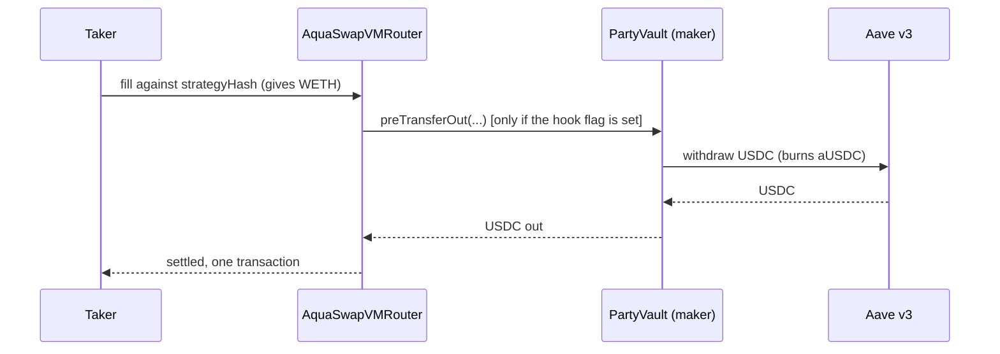

# The Aqua server module: integration reference

> `@id` PP-AQUA-DOC-004 · `@name` Aqua server module, integration reference ·
> `@implements-rules-version` v3 · `@hackathon` POO-1057 (Aqua Strategies, 1inch)

**Every external call `src/lib/aqua/` makes: what we send, what comes back, and where it is used.**
Index and product framing: [`README.md`](README.md). What was built, issue by issue:
[`00_IMPLEMENTATION_PLAN.md`](00_IMPLEMENTATION_PLAN.md). The page this module feeds:
[`02_INVESTOR_SURFACE.md`](02_INVESTOR_SURFACE.md). Upstream versions and attribution:
[`04_REFERENCES.md`](04_REFERENCES.md).

The on-chain half (PartyVault, AaveV3Adapter, deploy and ops scripts, the taker, and the canonical
`docs/VERIFIED.md`) lives in the companion public repository
[github.com/0xmvercosa/pool-party-aqua](https://github.com/0xmvercosa/pool-party-aqua). Nothing in
this document restates a contract fact without pointing at the address, the transaction or the file
that carries it.

| | |
|---|---|
| Chain | Arbitrum One (42161), mainnet only. There is no testnet path in this module. |
| Transport | viem `createPublicClient` over `ARBITRUM_RPC_URL` (default `https://arb1.arbitrum.io/rpc`) |
| Persistence | none. Money from chain on every request; the manager's labels are a committed fixture (section 3.1) |
| SDKs | `@1inch/swap-vm-sdk@0.3.0`, `@1inch/aqua-sdk@0.2.0`, `@1inch/sdk-core@0.1.2`, all pinned exact in `package.json` |
| Boundary | every module file imports `server-only`; the browser never reaches Arbitrum or Aqua |
| Tests | 71 across 3 files, green: `pnpm test src/lib/aqua` (compiler 40, boundary and addresses 22, ABIs 9) |
| Module docs | [`src/lib/aqua/README.md`](../../src/lib/aqua/README.md) |

---

## 1. Module map

Fifteen non-test TypeScript files. The rule that shapes the layout is SRV-R1: this module plays the
role `pool-party-api` plays for the rest of the app, so it owns persistence, chain orchestration and
the domain services, and nothing above it touches viem for Aqua data.

| File | What it does | What it may talk to |
|---|---|---|
| `index.ts` | The module's public surface: re-exports clients and address constants. Carries the `PP-INTEGRATION-POINT` marker for the whole module. | nothing directly |
| `config/addresses.ts` | Canonical Arbitrum addresses, decimals, the measured maker-hook signature and selector, the hook payload, and `assertNotDeadGeneration`. Mirrors `docs/VERIFIED.md` upstream. | nothing (pure constants) |
| `config/env.ts` | The only place server env is read (SRV-R4): `arbitrumRpcUrl()`, `takerPrivateKey()`, `hasTakerKey()`. | `process.env` |
| `chain/clients.ts` | Memoised viem public client, plus a separate wallet client for the taker key so read paths cannot accidentally require a signer. | Arbitrum RPC |
| `abis/partyVault.ts` | Narrow `as const` ABIs for the views the app actually calls: PartyVault, the carry adapter, Aqua `rawBalances`, the Chainlink feed. | nothing (declarations only) |
| `abis/*.json` | Committed artifacts exported from the contracts repo: `PartyVault.json`, `AaveV3Adapter.json`, `ICarryAdapter.json`. | nothing |
| `api/compiler/types.ts` | The frozen `Mandate`, `CompileContext` and `CompileResult` shapes. | nothing |
| `api/compiler/mandates.ts` | The two shipped mandates, `production` and `demo`. | nothing |
| `api/compiler/band.ts` | Band math: address ordering, the Chainlink-to-raw-price conversion, and the SDK's sqrt-price constructor. | `@1inch/swap-vm-sdk` |
| `api/compiler/compile.ts` | The only producer of Aqua programs and ship calldata. Every guardrail lives here. | `@1inch/swap-vm-sdk`, `@1inch/aqua-sdk`, `@1inch/sdk-core`, viem `keccak256` |
| `api/compiler/roll.ts` | `buildDock` and `buildRoll`, and the salt-must-change refusal. | `@1inch/aqua-sdk` |
| `api/compiler/context.ts` | Assembles the live inputs a compile needs: fresh Chainlink spot with a staleness gate, already-shipped total, next epoch. All three read from chain. | Arbitrum RPC |
| `api/discovery.ts` | Finds every PartyVault this manager owns, from the registry's `Shipped` log plus an `OWNER()` proof. A vault that never shipped does not appear, which is correct: it has no strategy to show. | Arbitrum RPC |
| `api/backfill.ts` | Decodes every ship a vault has made: mandate, band edges, spot at ship, deadline, salt and the ship tx. Reads only. This is where the band geometry on the page comes from. | Arbitrum RPC, `@1inch/*` SDKs |
| `api/vaultState.ts` | Everything the investor page shows, assembled server side. Every value and the band geometry from chain; only the settled-purchase list is committed. | Arbitrum RPC |

### 1.1 The server-only boundary, and the test that enforces it

`server-only` is a marker package: importing a module that carries it from a Client Component is a
build error in Next, not a runtime surprise. That guarantee is only as strong as the discipline of
putting the import on every file, so `src/lib/aqua/serverOnly.test.ts` checks it mechanically. It
walks the module tree, and for each non-test `.ts` file asserts the source starts with
`import "server-only";`.

One file is exempt: `config/public.ts`. The browser genuinely needs the deployed Aqua addresses, the
Arbitrum chain id and the USDC address, because it reads a USDC allowance before a deposit and
refuses the wrong chain. The exemption is not a hole, because the test enforces the conditions that
make it safe: the exempt file must contain no `process.env` and no key-shaped identifier. Everything
public in it is verifiable on Arbiscan.

The boundary has a practical consequence for tooling. Under `--conditions=react-server` the marker
resolves to a no-op; without it, it resolves to the throwing build. Every `pnpm aqua:*` script that
imports module code therefore runs `tsx --conditions=react-server`. Vitest sidesteps the same
problem differently: `vitest.config.ts` aliases `server-only` to `tests/__mocks__/server-only.ts`,
because in a test process there is no client/server boundary to protect.

---

## 2. The program compiler

This is the heart of the module: `src/lib/aqua/api/compiler/`. It turns a mandate plus live context
into the exact bytes a manager signs. Every platform guardrail is enforced here rather than in
review, so an out-of-policy program cannot be built at all, and every refusal names the rule that
caused it (`CompilerPolicyError`, which prefixes its message with `PRG-R3`, `PRG-R5` and so on).

`compile()` is a pure function of its arguments. The chain reads it needs are in
a separate file (`context.ts`) precisely so the compiler stays deterministic and testable without a
node, which is what makes the byte-level assertions in `compile.test.ts` possible.

### 2.1 The mandate

`Mandate` is the frozen policy shape (`types.ts`). Two are shipped:

| Field | `production` | `demo` | Meaning |
|---|---|---|---|
| `pair` | WETH / USDC | WETH / USDC | `base` is what we buy, `quote` is what we pay with |
| `bandLowPct` | `-1500` | `-30` | Band bottom, negative basis points from spot |
| `bandHighPct` | `-500` | `-10` | Band top, negative basis points from spot |
| `feeBps` | `80` | `80` | Flat fee accruing to the maker |
| `epochDays` | `3` | `3` | Sets the program deadline |
| `bandSleevePct` | `10` | `10` | Share of vault total assets one band may commit |
| `maxPerShip` | `150000000` (150 USDC) | `50000000` (50 USDC) | Hard per-ship cap, independent of the sleeve |
| `minBelowSpotBps` | `200` | `10` | Minimum distance the band top keeps below spot |

The two exist together on purpose. One vault backs both simultaneously with the same capital: the
production band is the real product and only fills on a genuine dip, while the demo band sits close
enough to market that our own taker can settle against it without waiting for a crash.

`minBelowSpotBps` is a **disclosed divergence from the written rule**, and the code says so at the
point of divergence (`compile.ts`, the PRG-R3 comment block). PRG-R3 as written fixes a flat 200 bps
margin. The demo mandate approved in the execution plan puts its band top at spot minus 0.1 percent,
which that flat rule refuses, so the launch as approved could not have been compiled at all. The
margin therefore became per-mandate. What does not bend is the invariant the rule exists to protect:
`band.highE8 >= band.spotE8` is checked first and unconditionally, for every mandate. The vault does
not enforce band placement at all, so this compiler check is the only guard there is.

### 2.2 From a band to sqrt prices

`concentrateGrowLiquidity2D` takes sqrt prices in 1e18 fixed point, where P is `tokenGt / tokenLt`
in **raw** token units, and `tokenGt` / `tokenLt` are ordered by **address**, not by role. Getting
the decimals wrong produces a band nowhere near the market and no error anywhere, so the conversion
is derived once, in `band.ts`, and pinned by tests.

For our pair, WETH (`0x82aF...`, 18 dp) sorts below USDC (`0xaf88...`, 6 dp), so `tokenLt` is WETH,
`tokenGt` is USDC, and P is USDC raw units per WETH raw unit:

```
P_x18 = answerE8 * 10^6 * 1e18 / (10^8 * 10^18)
```

which reduces to `priceUsd * 1e6`. ETH at $3,000 becomes `3_000_000_000`. `ethUsdToRawPriceX18`
refuses to run if the address ordering ever changes, rather than silently returning an inverted
price.

Band edges are integer basis-point arithmetic on the Chainlink answer, all in bigint:

```
lowE8  = spotE8 * (10000 + bandLowPct)  / 10000
highE8 = spotE8 * (10000 + bandHighPct) / 10000
```

`bandFromSpot` validates shape only (spot positive, both offsets negative, low strictly further
below spot than high). Policy checks that can refuse a ship live in `compile()` so every refusal
carries a rule reference.

The sqrt conversion itself is never done by hand. It is the SDK's:

```ts
ConcentrateGrowLiquidity2DArgs.fromRawPrices(band.rawPriceMinX18, band.rawPriceMaxX18)
```

Two tests pin the convention. One asserts `ethUsdToRawPriceX18` returns `3_000_000_000` for $3,000.
The other takes a **live gen-2 ship's** encoded `sqrtPriceMin`, `22760536265061421009` from a
WBTC(8 dp)/USDC(6 dp) band, squares it back and asserts the result lands on a sane BTC price. That
second test is the one that matters: it confirms the decimal convention against something the router
actually accepted, rather than against a formula that merely looks plausible.

### 2.3 The instruction sequence, and why that order

PRG-R1 **v3**, measured against the deployed router and confirmed end to end on an Arbitrum fork:

```ts
const program = new AquaProgramBuilder()
  .deadline({ deadline })
  .concentrateGrowLiquidity2D(concentrateArgsFor(band))
  .flatFeeAmountInXD({ fee: feeBpsToRaw(mandate.feeBps) })
  .xycSwapXD()
  .salt({ salt })
  .build();
```

No opcode byte is ever written by hand. `AquaProgramBuilder` refuses opcodes outside the Aqua
instruction set by construction.

The v2 order recorded in the rules document was wrong in three ways, and each correction is a
measured fact rather than a preference:

1. **`concentrateGrowLiquidity2D` is not the terminal curve, it shapes reserves.** `xycSwapXD` is the
   instruction that executes the swap on them. A program without it quotes zero output and reverts
   with `TakerTraitsAmountOutMustBeGreaterThanZero` on the deployed router.
2. **The flat fee belongs after concentrate and immediately before the curve.** A fee placed after
   the executing curve reverts at quote time.
3. **`salt` trails the curve** in every live program. It is a documented no-op that only affects the
   order hash, so trailing is fine.

The on-chain protocol-fee opcode is deliberately out of v1. It charges `tokenIn`, and our base side
ships at amount 0, so it would pull WETH the strategy does not have and revert the fill (proven on
the fork as an arithmetic underflow). `assertNoTokenInPullingOpcode` decodes the **built bytes** and
refuses `Fee.protocolFeeAmountInXD`, `Fee.aquaProtocolFeeAmountInXD`,
`Fee.dynamicProtocolFeeAmountInXD` and `Fee.aquaDynamicProtocolFeeAmountInXD`. Checking the bytes
rather than the builder chain means the guard stays true however the program is assembled.

Fee scaling is a trap worth naming: `FlatFeeArgs` is scaled so `1e9` is 100 percent, which puts one
basis point at `1e5`. 80 bps is therefore `8_000_000`, not `80`.

The strongest pin in the suite is on the bytes, not the instruction names. A SwapVM program is
`[opcode][argsLength][args]` repeated; the test walks that skeleton and asserts it exactly, then
asserts the walk consumed the program with no trailing bytes:

| Position | Opcode byte | Args length | Instruction |
|---|---|---|---|
| 0 | `0d` | 5 | `Controls.deadline` (uint40) |
| 1 | `12` | 64 | `XYCConcentrate.concentrateGrowLiquidity2D` (2 x uint256) |
| 2 | `15` | 4 | `Fee.flatFeeAmountInXD` (uint32) |
| 3 | `11` | 0 | `XYCSwap.xycSwapXD`, the executing curve |
| 4 | `14` | 8 | `Controls.salt` (uint64) |

A name-based test would still pass through an opcode-table drift or a reordering. This one will not,
because the skeleton is exactly what the router dispatches on. A companion test asserts the literal
substring `1504007a1200`, which is the 80 bps fee at 1e9 scale, encoded.

### 2.4 Assembling the Order, and the hook that was missing

```ts
const traits = MakerTraits.default().with({
  preTransferOutHook: new Interaction(Address.ZERO_ADDRESS, new HexString(MAKER_HOOK_DATA)),
});
const order = Order.new({ maker: new Address(context.maker), traits, program });

const orderBytes = order.encode().toString() as `0x${string}`;
const strategyHash = keccak256(orderBytes);
```

`Interaction` comes from `@1inch/sdk-core`, imported directly and pinned to the exact version
`swap-vm-sdk` depends on, so the class identity the SDK checks against is the one we construct.

Three properties of the traits, each asserted rather than assumed (`compile.test.ts`, "keeps the
Aqua-mode traits the router requires"): `useAquaInsteadOfSignature` is true, `shouldUnwrap` is false,
`customReceiver` is undefined. Aqua mode authenticates by the ship rather than a signature, and it
rejects both a custom receiver and a WETH unwrap upstream, so the defaults are the only valid choice.

**The preTransferOut hook is not optional for this product, and its absence is silent.** The measured
signature is:

```
preTransferOut(address,address,address,address,uint256,uint256,bytes32,bytes,bytes)
selector 0x5a394f80
```

Nine arguments. It is **not** in the published SwapVM ABI. It was measured twice and independently:
once by capturing the raw calldata the live router sends to a maker contract and matching the
selector, once by deriving the same signature from `swap-vm` v1.0.1 `IMakerHooks.sol`.
`forge inspect PartyVault methodIdentifiers` confirms the deployed vault exposes it. The selector is
not trusted as a constant either: `serverOnly.test.ts` derives it with viem's `toFunctionSelector`
from the signature we publish, so an edit to one cannot silently leave the other pointing at a
function nobody calls.

The hook must ride an `Interaction` whose target is the zero address, which means "call the maker
itself", and whose data is non-empty, because the SDK's `Interaction` asserts non-empty hex bytes.
`MAKER_HOOK_DATA` is therefore a single byte, `0x01`. The vault ignores it; the router forwards it
untouched as `makerHookData`. The launch payload builder in the contracts repo uses the same byte,
which keeps the two program producers byte-identical for the same inputs.

**Commit `3c5d630a` fixed exactly this.** The compiler shipped with a plain `MakerTraits.default()`
and no hook, and the first self-audit missed it, because the audit checked the four named rule items
and the hook *constants*, not whether the hook was wired into the order. What that omission would
have broken, in the order a demo would have discovered it:



Without the flag the router never calls the vault, so the vault never unparks. The ship still
succeeds. Quotes still look right. Fills smaller than the 5 percent hot buffer still settle. Only a
fill larger than the buffer fails, and that is precisely the just-in-time path the product is built
around and the one trace the demo exists to show. Three of the five mainnet fills hit it, the
flagship being
[`0xbc64ec2db39c6a8f718487268e4195c63e472f0ad0ae1f46e09919a1a9c5bb83`](https://arbiscan.io/tx/0xbc64ec2db39c6a8f718487268e4195c63e472f0ad0ae1f46e09919a1a9c5bb83):
0.0003 WETH for 0.556382 USDC, one transaction containing the aUSDC burn, the Aqua pull and the WETH
push.

The regression guard is a test that decodes `orderBytes` and asserts the hook is present, its target
is the zero address and its data is `MAKER_HOOK_DATA`.

### 2.5 The ship call

```ts
const shipCall = new AquaProtocolContract(new Address(AQUA_REGISTRY)).ship({
  app: new Address(context.app),
  strategy: new HexString(orderBytes),
  amountsAndTokens: [
    { token: new Address(mandate.pair.quote), amount: shipQuote },
    { token: new Address(mandate.pair.base), amount: ZERO },
  ],
});
```

Two details are load-bearing. First, `strategy` is the **ABI-encoded Order**, not the bare program
(PRG-R9): the program lives in the last slice of `order.data`, and `strategyHash` is
`keccak256(orderBytes)`, which is what the registry stores. A test asserts both directions, including
that hashing the bare program gives a different value. Second, **both tokens are registered** even
though the base side ships at 0 (PRG-R2): `tokensCount` comes from this array, and
`safeBalances` / push refuse any token that was not registered at ship time.

The SDK exports an `AQUA_CONTRACT_ADDRESSES` table. The compiler does not read it. It constructs
`AquaProtocolContract` with our own `AQUA_REGISTRY` constant, which is the measured gen-2 address
(see [section 5](#5-addresses-one-source-and-one-trap)).

### 2.6 What `compile()` returns

| Field | Type | Notes |
|---|---|---|
| `mandate` | `"production" \| "demo"` | echoed back for the ship record |
| `program` | `0x${string}` | the bare SwapVM program bytes |
| `orderBytes` | `0x${string}` | ABI-encoded Order: what goes on chain |
| `strategyHash` | `0x${string}` | `keccak256(orderBytes)`, dead forever once docked |
| `shipCallInfo` | `{ to, data, value }` | mirrors the SDK's `CallInfo`, ready for a wallet to sign |
| `shipped` | `{ quote: bigint; base: bigint }` | base is always 0, and always registered |
| `band` | `CompiledBand` | spot, low, high (all 8 dp) plus both raw x18 prices |
| `deadline` | `bigint` | `now + epochDays * 86400` |
| `salt` | `bigint` | equals the epoch id |
| `epoch` | `number` | |
| `instructions` | `string[]` | human-readable decode, stored with the ship so a program stays reviewable |

The refusals, each with a failing input in the suite:

| Rule | Refuses |
|---|---|
| PRG-R3 | a band top at or above spot (unconditional), or closer to spot than `minBelowSpotBps` |
| PRG-R5 | a non-positive ship, or one above `min(maxPerShip, bandSleevePct% x totalAssets)` |
| PRG-R6 | a ship that would push `alreadyShipped + shipQuote` above the liquid quote, dropping coverage below 1.0 |
| PRG-R4 | a negative or non-integer epoch |
| PRG-R2 / PRG-R7 | a built program containing any `tokenIn`-pulling fee opcode |
| (addresses) | the dead gen-1 router or registry as `app` |

### 2.7 The salt-must-change invariant

PRG-R10 is the rule that bites hardest in practice. **A docked `strategyHash` is dead forever.** The
registry stores a docked marker rather than zeroing the slot, so re-shipping identical bytes reverts
with `StrategiesMustBeImmutable` (proven on the fork). Every roll must therefore change the salt.

`buildRoll` refuses to hand back a payload that would not, in two independent ways:

1. Before doing any work, it refuses `context.epoch === previous.epoch`, so the error names the real
   problem instead of surfacing as an on-chain revert.
2. After compiling, it compares the new `strategyHash` against the docked one and refuses a match,
   because the epoch could differ while some other change cancels it out. What matters on chain is
   that the **hash** is new.

A roll is `dock(old) + ship(new)` executed as one manager action (PRG-R8). `buildDock` passes both
registered tokens, because a partial dock reverts with `DockingShouldCloseAllTokens`.

Epoch allocation is `nextEpoch(maker)` in `context.ts`: the highest epoch recorded for that maker,
plus one. Rows are never reused; a roll writes a new row and marks the old one docked.

### 2.8 Cross-producer equivalence

There are **two** program producers in this project: this compiler, and `scripts/build-orders.ts` in
the contracts repo, which is what actually mints the launch payloads. If they disagree, the strategy
the vault ships is not the strategy this app describes.

`compile.test.ts` carries a reference implementation built the way that script builds it,
deliberately from the raw SDK rather than by calling our own helpers, so it is a genuine second
opinion rather than a tautology. It asserts identical `orderBytes` for both mandates and therefore an
identical `strategyHash`. That test is how the missing `preTransferOut` hook was caught.

---

## 3. Chain reads

`api/vaultState.ts` is the only read aggregator, and it is what the investor page renders. Two rules
shape it:

- **IDX-R2: money is always read fresh.** Every monetary number on the page comes from Arbitrum on
  the request, never from a cache and never from a stored copy. The page is `force-dynamic` for
  the same reason.
- **FE-R7: missing real data hides the section.** The function returns a discriminated state
  (`not-launched` or `live`) rather than zeros, so the page can never present an invented number as
  a real one.

| Contract | Address | Call | Composed into |
|---|---|---|---|
| PartyVault | `AQUA_VAULT_ADDRESS` | `getCode` | presence check: no code means `not-launched`, with a reason |
| PartyVault | `AQUA_VAULT_ADDRESS` | `totalAssets()` | `nav.totalAssetsUsdc` |
| PartyVault | `AQUA_VAULT_ADDRESS` | `totalShares()` | `nav.totalShares` |
| PartyVault | `AQUA_VAULT_ADDRESS` | `activeStrategies()` | the list of `bytes32` hashes the band cards are built from |
| PartyVault | `AQUA_VAULT_ADDRESS` | `ADAPTER()` | the carry adapter address, and the Arbiscan link on the verify block |
| USDC | [`0xaf88d065e77c8cC2239327C5EDb3A432268e5831`](https://arbiscan.io/address/0xaf88d065e77c8cC2239327C5EDb3A432268e5831) | `balanceOf(vault)` | `sleeves.hotBufferUsdc` |
| WETH | [`0x82aF49447D8a07e3bd95BD0d56f35241523fBab1`](https://arbiscan.io/address/0x82aF49447D8a07e3bd95BD0d56f35241523fBab1) | `balanceOf(vault)` | `sleeves.acquiredWeth`, and `nav.wethValuedUsdc` after marking |
| AaveV3Adapter | from `ADAPTER()` | `parkedBalance(USDC)` | `sleeves.parkedUsdc` |
| Aqua registry | [`0x1111113CCf1426A8E30e2bfF5E005d929bF6a90a`](https://arbiscan.io/address/0x1111113CCf1426A8E30e2bfF5E005d929bF6a90a) | `rawBalances(maker, app, strategyHash, token)` | per band: `committedUsdc` (USDC) and `acquiredWeth` (WETH) |
| Chainlink ETH/USD | [`0x639Fe6ab55C921f74e7fac1ee960C0B6293ba612`](https://arbiscan.io/address/0x639Fe6ab55C921f74e7fac1ee960C0B6293ba612) | `latestRoundData()` | `price.ethUsdE8`, and the mark for the WETH sleeve |
| (RPC) | | `getBlock()` | `price.ageSeconds = block.timestamp - updatedAt`, and `price.stale` |

Notes that matter when reading the numbers:

- **`rawBalances` is Aqua's per-strategy accounting, not a wallet balance.** It returns
  `(uint248 balance, uint8 tokensCount)` and is keyed by the full tuple
  `(maker, app, strategyHash, token)`, which is why the router address is part of the read. The app
  passed is always the gen-2 `AquaSwapVMRouter`.
- **`parkedBalance` is interest-inclusive** (ADP-R3): it reads the aToken balance, so it grows every
  block. That is the "always earning" half of the product, visible as a number that moves without
  anything happening.
- **The two soft reads degrade rather than throw.** `ADAPTER()` falls back to `null` and
  `parkedBalance` falls back to 0, so a vault deployed without an adapter renders honestly instead
  of erroring. Both are `.catch(...)` on the read, not a mock.
- **Marking is integer arithmetic**: `wethToUsdcRaw(wethRaw, priceE8) = wethRaw * priceE8 / 10^20`,
  where the exponent is `DECIMALS.WETH + 8 - DECIMALS.USDC`. No JS float touches money anywhere in
  this module.
- **Staleness is 90 minutes** (D9), defined independently in two places for two purposes:
  `vaultState.ts` flags `price.stale` so the page can say the price is not trustworthy, while
  `context.ts` `readSpot()` **throws** past the same bound, because a band built around a stale
  price is a strategy at the wrong level. The bound has room: measured over 24 hours the feed
  updated 360 times, median gap 121 seconds, maximum gap 29.5 minutes.

### 3.1 Where the band geometry comes from

The mandate name and the band edges in USD are not stored anywhere. They are **decoded from the Aqua
registry's own `Shipped` log** by `api/backfill.ts`:

- `Shipped` carries the ABI-encoded Order; the program inside carries the deadline, the concentrate
  bounds and the salt
- the band edges invert exactly out of the concentrate encoding
- the mandate is identified from the band's high/low ratio, which is distinct per mandate and needs
  no knowledge of the price at ship time; the spot at ship then follows exactly from the high edge

This is worth stating because two earlier revisions got it wrong in the same direction. The first
kept the geometry in a Postgres table; the second, having deleted the table, kept it as a committed
fixture and argued the values were unrecoverable. They were recoverable. When the decode landed it
disagreed with the fixture's inferred spot by about $25, and the chain was right.

An unrecognised band shape stays `unknown` rather than being forced into a mandate, and FE-R7
applies: a band whose log will not decode still renders its live money with its edges omitted rather
than guessed.

The one thing still committed is the settled-purchase list (`data/managerMetadata.ts`). Decoding a
fill means matching settlement logs across the router and the vault and attributing them to a band,
and that indexer is named as not built rather than quietly skipped. Every row there is a real
Arbitrum transaction that resolves on Arbiscan, and each is self-directed: executed by the project's
own taker against its own strategy, so they prove the machine settles, not that there was organic
demand. The page says exactly that above the list.


---

## 4. The ABI artifacts

`src/lib/aqua/abis/` holds three committed JSON artifacts, exported from the contracts repo by
`contracts/script/export-abis.sh`:

| Artifact | Entries | Contents |
|---|---|---|
| `PartyVault.json` | 57 | 30 functions including `preTransferOut`, `execShip`, `execDock`, `parkUsdc`, `unparkUsdc`, `deposit`, `redeem`; 9 events including `JitUnparked`, `StrategyShipped`, `StrategyDocked` |
| `AaveV3Adapter.json` | 14 | `POOL`, `A_TOKEN`, `UNDERLYING`, `VAULT`, `park`, `unpark`, `parkedBalance` |
| `ICarryAdapter.json` | 3 | the adapter interface: `park`, `unpark`, `parkedBalance` |

**Why committed here rather than imported across repositories.** The contracts live in a separate
repository that publishes no npm package, and a path dependency between two independently cloned
repos is not something a judge or a fresh checkout can resolve. Committing the artifact makes the
coupling explicit and diffable: the exact ABI this app was built against is in the tree, a contract
change shows up as a reviewable diff rather than as a silent resolution to whatever happens to be on
disk, and a test can compare our narrow ABI against it.

**Why there is a narrow ABI as well.** The JSON is a bare ABI array, which gives viem nothing to
infer from, so every read would need a cast and would return `unknown`. `abis/partyVault.ts`
declares the handful of views the page actually calls as `as const`, which gives full inference and,
more usefully, documents exactly which parts of the vault this app is coupled to.

**What `abis.test.ts` guarantees** (9 assertions):

1. Every entry in `PARTY_VAULT_VIEW_ABI` exists in `PartyVault.json` with identical input types,
   output types and `stateMutability`. Seven names are covered: `totalAssets`, `totalShares`,
   `liquidUsdc`, `activeStrategies`, `ADAPTER`, `maxTvl`, `seeded`.
2. The narrow ABI declares only `view` functions, since this page never writes.
3. `PartyVault.json` carries `preTransferOut` with exactly the nine measured argument types, so the
   vault we read is the vault Aqua calls.

The failure this prevents is specific: a contract change renames or removes a view, the artifact is
re-exported, and the page keeps compiling against a const ABI describing a function nobody
implements. It would fail at runtime, against mainnet, during the demo.

Two honest gaps. `AaveV3Adapter.json` and `ICarryAdapter.json` are committed but nothing asserts
against them, and `CARRY_ADAPTER_VIEW_ABI` is hand-declared without a matching check. And three
entries in the narrow vault ABI, `liquidUsdc`, `maxTvl` and `seeded`, have no caller on this branch
yet; they are declared because the deposit surface will need them.

---

## 5. Addresses: one source, and one trap

`src/lib/aqua/config/addresses.ts` is the single place this app learns an address (POO-1058 R2).
Nothing else hardcodes one, and the constants are re-exported through `src/lib/aqua/index.ts` so
even the view layer imports them rather than pasting a hex string (`VerifyBlock.tsx` does exactly
this for the two 1inch contracts).

The file is a **mirror** of `docs/VERIFIED.md` in
[pool-party-aqua](https://github.com/0xmvercosa/pool-party-aqua), which is the source of truth and
carries the evidence for every value. If that file changes, this one is re-synced; it does not
acquire values of its own.

| Constant | Address | Note |
|---|---|---|
| `AQUA_REGISTRY` | [`0x1111113CCf1426A8E30e2bfF5E005d929bF6a90a`](https://arbiscan.io/address/0x1111113CCf1426A8E30e2bfF5E005d929bF6a90a) | official 1inch gen-2, used unmodified |
| `AQUA_SWAP_VM_ROUTER` | [`0x1111113Db0e0ef9D0E3A50d5f094a3a57a26C0DE`](https://arbiscan.io/address/0x1111113Db0e0ef9D0E3A50d5f094a3a57a26C0DE) | official 1inch gen-2, used unmodified |
| `DEAD_GEN1_REGISTRY` | `0x499943e74fb0ce105688beee8ef2abec5d936d31` | dead, listed only so guards can refuse it |
| `DEAD_GEN1_ROUTER` | `0x8fdd04dbf6111437b44bbca99c28882434e0958f` | dead, listed only so guards can refuse it |
| `TOKENS.USDC` | [`0xaf88d065e77c8cC2239327C5EDb3A432268e5831`](https://arbiscan.io/address/0xaf88d065e77c8cC2239327C5EDb3A432268e5831) | native Arbitrum USDC, **not** USDC.e |
| `TOKENS.WETH` | [`0x82aF49447D8a07e3bd95BD0d56f35241523fBab1`](https://arbiscan.io/address/0x82aF49447D8a07e3bd95BD0d56f35241523fBab1) | |
| `CHAINLINK_ETH_USD` | [`0x639Fe6ab55C921f74e7fac1ee960C0B6293ba612`](https://arbiscan.io/address/0x639Fe6ab55C921f74e7fac1ee960C0B6293ba612) | 8 decimals |
| `AAVE_V3_POOL` | [`0x794a61358D6845594F94dc1DB02A252b5b4814aD`](https://arbiscan.io/address/0x794a61358D6845594F94dc1DB02A252b5b4814aD) | the carry leg |
| `AAVE_A_USDC` | [`0x724dc807b04555b71ed48a6896b6F41593b8C637`](https://arbiscan.io/address/0x724dc807b04555b71ed48a6896b6F41593b8C637) | |

Our own deployments, both source-verified on Arbiscan, are named here rather than in this file
because they belong to the contracts repo: PartyVault
[`0xec870a6A9E8EE41B349FD0766b8f295D6EDC6610`](https://arbiscan.io/address/0xec870a6A9E8EE41B349FD0766b8f295D6EDC6610)
and AaveV3Adapter
[`0x6d409fF8578D017AddDB2e9Ad0848D8F0A65aBAe`](https://arbiscan.io/address/0x6d409fF8578D017AddDB2e9Ad0848D8F0A65aBAe).
The app reaches the vault through `AQUA_VAULT_ADDRESS` and the adapter through the vault's own
`ADAPTER()` view, so neither is hardcoded.

**The gen-1 trap.** There are two Aqua deployments on Arbitrum. Gen 1 is a dead parallel deployment
(43 ships, last activity around 2026-04) and it is what the upstream READMEs document, so following
the public docs literally lands you on contracts nobody fills against. Gen 2 is live, and the pair
above was confirmed by reading `router.AQUA()` and checking it returns the registry. Because the
wrong address produces a strategy that ships successfully and is simply never filled, the failure is
silent, so `assertNotDeadGeneration(address)` refuses the gen-1 pair case-insensitively and
`compile()` calls it on `context.app` before doing any other work. `serverOnly.test.ts` asserts the
literal gen-2 values, asserts the refusal in both cases, and asserts the gen-2 pair is accepted.

---

## 6. Environment and secrets

`config/env.ts` is the only reader of `process.env` in the module (SRV-R4), and it validates on
access rather than at import, so a route that never touches Aqua pays nothing and a missing variable
fails at the call site with a message naming the variable.

| Variable | Required | Read by | Behaviour when unset |
|---|---|---|---|
| `ARBITRUM_RPC_URL` | no | `arbitrumRpcUrl()` | falls back to `https://arb1.arbitrum.io/rpc`, fine for reads, rate-limited |
| `TAKER_BOT_PRIVATE_KEY` | only to send transactions | `takerPrivateKey()`, `hasTakerKey()` | read-only paths are unaffected; signing refuses |
| `NEXT_PUBLIC_AQUA_VAULT_ADDRESS` | yes, for the investor page | `api/vaultState.ts`, `operations/aquaActions.ts`, `hooks/useAquaLiquidity.ts` | the page renders its honest `not-launched` state |

`ARBITRUM_RPC_URL` and `TAKER_BOT_PRIVATE_KEY` **cannot become `NEXT_PUBLIC_*`**, because every file
that reads them carries `server-only`. The vault address is the deliberate opposite: a deployed
contract address is public by definition and the browser needs it for the pre-deposit allowance
check, so it is `NEXT_PUBLIC_` and the three readers share one resolution order. All three variables
are documented in `.env.example` with their unset behaviour.

Two boundary rules, both stated in code at the point they apply:


- **SRV-R5 and BOT-R4, the keys.** The manager key never reaches this process. Every manager
  transaction is emitted as calldata for a human wallet to sign. `TAKER_BOT_PRIVATE_KEY` is a
  separate wallet holding only the taker's working capital, and `chain/clients.ts` keeps the signing
  client in a different function from the public client so a read path cannot accidentally require
  a key.

One divergence worth naming rather than hiding. `NEXT_PUBLIC_AQUA_VAULT_ADDRESS` is read directly
with `process.env` in three files rather than through `config/env.ts`, so SRV-R4's "single reader"
property does not hold for it. That is deliberate and cannot be otherwise: `config/env.ts` carries
`server-only`, and one of the three readers is the browser's pre-deposit allowance check. Each site
validates against `/^0x[0-9a-fA-F]{40}$/` and they share one resolution order, which is the property
that actually matters. It holds no secret: it is a deployed address, verifiable on Arbiscan.

---

## 7. The CLI entrypoints

`scripts/aqua/`. These are the manager surface for the hackathon window: the console UI was cut
(POO-1068), and **nothing here signs anything**. Each command compiles, checks policy, and
prints calldata for a wallet to sign plus the metadata block to commit.

| Command | Script | What it does |
|---|---|---|
| `pnpm aqua:ship --mandate <name> --vault 0x... [--amount N]` | `strategy.ts` | reads fresh spot, compiles one band, prints the ship transaction and the metadata block to commit |
| `pnpm aqua:launch-payloads --vault 0x... --production 60 --demo 40` | `strategy.ts` | both bands at once, sized so the combined ship stays inside one sleeve |
| `pnpm aqua:roll --strategy 0x... --vault 0x... --mandate <name>` | `strategy.ts` | `dock(old)` plus `ship(new)` with a fresh salt, printed as one manager action |
| `pnpm aqua:dock --strategy 0x... --mandate <name>` | `strategy.ts` | the dock transaction alone |
| `pnpm aqua:discover` | `discover.ts` | scans the Aqua registry's `Shipped` log for vaults this manager owns, and decodes every band each has shipped. The same code path the page uses, run standalone |

Every script that imports module code runs `tsx --conditions=react-server`, for the reason in
[section 1.1](#11-the-server-only-boundary-and-the-test-that-enforces-it), and loads `.env.local`
itself with dotenv before importing anything, so the env guard sees the values. Module imports are
deliberately lazy (`await import`) so a usage error does not first require a database connection.

`db-check.ts` deserves a line of its own. Its most useful assertion is not that the tables exist but
that `salt` and `shipped_usdc` come back from Postgres as JavaScript **strings**. Token amounts are
raw integer units in `numeric(78,0)` columns (78 digits covers uint256); if one ever decoded to a
`number`, precision would already be gone on any realistic WETH amount, and it would be gone
silently. The repo targets ES2017, so bigints are constructed with `BigInt(...)` rather than written
as `0n` literals.

Two behaviours of `strategy.ts` a reader should know before trusting its coverage arithmetic:

- Rows are written with `status: "pending"`, and `readAlreadyShipped` counts only `status: "active"`.
  The confirm step that would flip them (`aqua:confirm`, named in a comment at
  `scripts/aqua/strategy.ts:170`) **does not exist as a script on this branch**, so today
  `readAlreadyShipped` returns 0 for anything this CLI recorded and PRG-R6 has nothing to bite on
  from the database. This is why `launch-payloads` threads `alreadyShipped` explicitly between the
  two bands (`alreadyShipped + production.shipped.quote`) instead of relying on a round trip: the
  two-band launch is covered by construction.
- The `roll` command's comment says the docked strategy's size is freed, but the value it passes is
  the unreduced `readAlreadyShipped` total. The effect is a stricter coverage check than the rule
  requires, so it can only refuse a roll, never wave one through.
- `ship_tx_hash`, `dock_tx_hash`, `shipped_at` and `docked_at` are columns nothing on this branch
  writes, so `BandView.shipTxHash` is null until a confirm step exists.

---

## 8. What this module deliberately does not do yet

Stated plainly, because a reference that only lists what works is not a reference.

| Not built | What exists instead | Why |
|---|---|---|
| **Keeper loop** | the roll is a manual `pnpm aqua:roll` producing calldata a human signs | automating a roll means holding a key that can move strategies, which is a custody decision, not a hackathon one. `aqua_keeper_log` is designed and deferred. |
| **Indexer** | fills are a committed fixture of real Arbitrum transactions, read by the investor page | the fill indexer lives on the contracts side for the window. `FillView` does not change shape, so a live feed swaps in without moving anything downstream. |
| **Aggregator routing** | none. No 1inch aggregator, Fusion or quote endpoint is called anywhere in the module | the vault is a **maker**: it publishes a curve and waits to be filled. Routing is the taker's problem, and our taker lives in the contracts repo. |
| **The taker, in this repo** | `takerWalletClient()` and `hasTakerKey()` exist and are exported, with no caller on this branch | the client is here so the surface is complete and the key boundary is expressed in one place; the loop that would use it is upstream. |
| **Deposit and redeem** | the investor page is strictly read-only | shipping the read-only view first means the page can never show a control that does not work. `liquidUsdc`, `maxTvl` and `seeded` are already declared in the narrow ABI for it. |
| **Any persistence** | none at all | the status path and the page read live state from chain rather than a stored series, so no table is needed to ship, and a NAV table would invite serving a cached number (IDX-R2). |
| **In-vault oracle staleness gate (VLT-R4)** | the off-chain 90-minute check in `context.ts`, which throws | deferred on the contract side for the window, which makes the off-chain check the only thing between a stale feed and a band built at the wrong level. Named here so nobody assumes the vault enforces it. |

---

## 9. Reproducing the checkable parts

```bash
pnpm test src/lib/aqua     # 71 assertions: program bytes, order encoding, guardrails, ABI parity
pnpm aqua:ship --mandate demo --vault 0x... --total-assets 1000 --dry-run
```

The first needs nothing but a checkout: no key and no RPC. It is the one that pins the
program order, the fee scaling, the hook, the `strategyHash` definition and the cross-producer
equivalence, which is most of what this document claims. The third still reads Chainlink over RPC
and reads the epoch and coverage totals from the database; `--dry-run` only suppresses the write.
