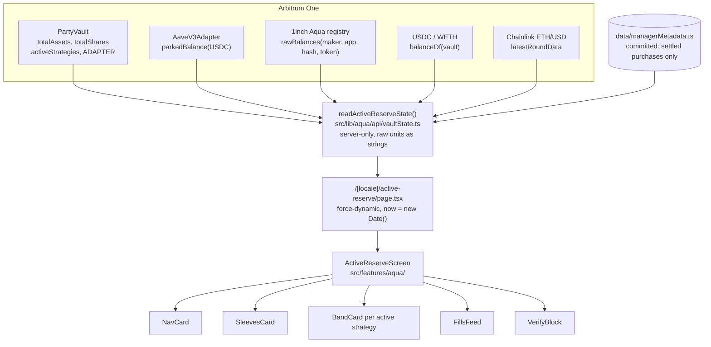

<!--
@id PP-AQUA-DOC-002
@name Active Reserve investor surface, reference
@implements-rules-version v3
@hackathon POO-1057 (Active Reserve on 1inch Aqua)
-->

# The Active Reserve investor page

**What an investor sees, and where every number on it comes from.** The page is
`src/features/aqua/ActiveReserveScreen.tsx` (`@id PP-AQUA-SCR-001`), served at
`/[locale]/active-reserve` and read live from Arbitrum on every request.

> **It is read-only in this window.** There is no deposit control, no redeem control and no wallet
> connection on this page. Deposits and redemptions are executed from the CLI in the companion
> on-chain repository, [`0xmvercosa/pool-party-aqua`](https://github.com/0xmvercosa/pool-party-aqua);
> the manager's band operations (ship, roll, dock) run from `scripts/aqua/strategy.ts` in this
> repository. The page's job for the event is to make the vault's state legible and checkable, not to
> take money.

Related: [`01_AQUA_INTEGRATION.md`](01_AQUA_INTEGRATION.md) for the server module that feeds this
page, [`03_PRE_EXISTING_VS_NEW.md`](03_PRE_EXISTING_VS_NEW.md) for what pre-dates the event, and
[`04_REFERENCES.md`](04_REFERENCES.md) for addresses, SDKs and attribution.

---

## 1. Why read-only, and what a write path would add

The window was short and the surface had to be honest, so the ordering rule was: **never render a
control that does not work.** A "Deposit" button that opens a modal wired to nothing is worse than no
button, because it is the one element on the page an evaluator will click first.

Read-only also happens to be the part with the most evidence value. Everything on the page is a live
`eth_call` against contracts anyone can open on Arbiscan, so the page doubles as a verification
surface rather than a marketing one.

What a write path would need, stated so the gap is not mistaken for hand-waving:

| To add | What it needs | Where it would live |
|---|---|---|
| Deposit | `PartyVault.deposit` calldata built server-side, USDC allowance check, the shipped `useWalletSignFlow` step machine, the cap check against `maxTvl()` | a new `src/lib/aqua/api/` action plus a client component under `src/features/aqua/` |
| Redeem | share-to-asset quoting off `totalAssets()` / `totalShares()`, plus the illiquidity case the disclosure already names (value sitting in ETH just after a fill) | same |
| Per-investor position | a share balance read per connected address; the page currently reads `totalShares()` and shows no per-user number at all | same |

None of those exist on this branch. The page reads `totalShares()` into `ActiveReserveState` and
deliberately does not render it, because a share count with no share price and no per-user balance is
a number that invites a wrong reading.

---

## 2. The blocks, and why each one exists

Rendered top to bottom by `ActiveReserveScreen`:

| Block | File | Why it is on the page |
|---|---|---|
| Name, tagline, official description | `src/features/aqua/copy.ts` | The product description is used verbatim here and in the submission (FE-R10). One string, one source. |
| Stale-price notice | `ActiveReserveScreen.tsx` (`role="status"`) | Everything below is priced off one Chainlink read. If that read is old, the reader learns it before reading the numbers, not after. |
| `NavCard` | `components/NavCard.tsx` | Total value plus the three things it is made of. The whole product claim is that the money is in two places at once, so a single NAV figure would hide exactly the thing worth seeing. |
| `SleevesCard` | `components/SleevesCard.tsx` | The measured split between capital lent on Aave and cash on hand. Deliberately not a claimed "95/5": the bar renders the ratio the vault actually holds. |
| `BandCard` (one per active strategy) | `components/BandCard.tsx` | The buy band drawn against live spot. Seeing the market marker sitting above the shaded range is what makes "it only fills when the market comes down to it" obvious without a paragraph. |
| `FillsFeed` | `components/FillsFeed.tsx` | Every purchase, with its Arbiscan link, the price actually paid, and a badge on the fills that were funded out of Aave inside the settlement transaction. |
| `VerifyBlock` | `components/VerifyBlock.tsx` | Our vault and adapter next to the official 1inch registry and router, all linked. The claim is that this runs on unmodified 1inch gen-2 infrastructure, and the cheapest support for that claim is letting anyone click through. |
| Disclosure | `copy.ts` (`COPY.disclosure`) | Unaudited contracts, Aave risk, the fact that a buy band is a commitment to buy, and that withdrawals pay USDC. Rendered in **every** state, including before launch. |

Sections that have nothing true to say are removed, not zero-filled (FE-R7):

- `bands.length === 0` removes the whole band section, heading included.
- `SleevesCard` returns `null` when hot buffer plus parked balance is zero.
- `VerifyBlock` omits the adapter row rather than linking the zero address.
- `BandCard` omits the geometry, the edges and the percentages when the ship record is missing, and still shows the live money for that strategy.
- `FillsFeed` with no rows prints why the list is empty instead of an empty panel.
- No vault address configured, or no code at that address, collapses the page to the "Not deployed yet" state.

---

## 3. Where every number comes from

All chain reads are in `src/lib/aqua/api/vaultState.ts` (`readActiveReserveState`), which is
`server-only` and returns a discriminated `ActiveReserveState`. Money crosses that boundary as raw
integer **strings**; formatting is the view layer's job.

| Shown as | Field | Source |
|---|---|---|
| Total value | `nav.totalAssetsUsdc` | `PartyVault.totalAssets()` on the vault |
| Earning interest | `sleeves.parkedUsdc` | `AaveV3Adapter.parkedBalance(USDC)`, the interest-inclusive aToken balance (ADP-R3), on the adapter read from `PartyVault.ADAPTER()` |
| Cash on hand | `sleeves.hotBufferUsdc` | `balanceOf(vault)` on native USDC `0xaf88d065e77c8cC2239327C5EDb3A432268e5831` |
| ETH bought | `sleeves.acquiredWeth` | `balanceOf(vault)` on WETH `0x82aF49447D8a07e3bd95BD0d56f35241523fBab1` |
| ETH bought, in USD | `nav.wethValuedUsdc` | derived: `wethToUsdcRaw(acquiredWeth, ethUsdE8)`, exact bigint math, no float |
| Market price now | `price.ethUsdE8` | Chainlink ETH/USD `0x639Fe6ab55C921f74e7fac1ee960C0B6293ba612`, `latestRoundData()`, 8 decimals |
| Price age, staleness | `price.ageSeconds`, `price.stale` | current block timestamp minus the feed's `updatedAt`; stale above `MAX_STALENESS_SECONDS` (90 minutes, D9) |
| Which bands exist | `bands[].strategyHash` | `PartyVault.activeStrategies()` |
| Reserved to buy | `bands[].committedUsdc` | `AquaRegistry.rawBalances(vault, router, strategyHash, USDC)` on `0x1111113CCf1426A8E30e2bfF5E005d929bF6a90a` |
| ETH bought, per band | `bands[].acquiredWeth` | same call with the WETH address |
| Band edges, mandate, epoch, deadline, ship tx | `bands[].lowE8` / `highE8` / `mandate` / `epoch` / `deadline` / `shipTxHash` | decoded from the Aqua registry's `Shipped` log by `api/backfill.ts`: the edges invert out of the concentrate encoding, the mandate from the high/low ratio |
| Purchases | `fills[]` | **the one non-chain source on this page**: `src/lib/aqua/data/managerMetadata.ts`, newest first, capped at 25. Every row is a real Arbitrum transaction and links to Arbiscan |
| Vault, adapter, 1inch contracts | `vault`, `adapter`, constants | `NEXT_PUBLIC_AQUA_VAULT_ADDRESS` plus `PartyVault.ADAPTER()`; the 1inch pair comes from `src/lib/aqua/config/addresses.ts` |

Three things about that table are worth stating plainly.

**Everything except the purchase list is live.** Read the provenance column again: every row
resolves to an Arbitrum call, including the band geometry. The mandate name and the price range are
decoded from the registry's own `Shipped` log rather than stored, which is worth saying because two
earlier revisions of this page stored them, first in Postgres and then in a committed fixture, on
the belief that they were unrecoverable. They were recoverable, and the decode disagreed with the
fixture by about $25 on spot.

A band whose log will not decode still renders its live money, with the geometry omitted rather than
guessed (FE-R7).

**The fills are real and self-directed.** Every row is an Arbitrum transaction that resolves on
Arbiscan, and each was executed by the project's own taker against its own strategy: they prove the
machine settles, not that there was organic demand. The page says exactly that above the list
(`COPY.fills.selfDirected`) before showing a single row.

**Money is never read from a cache.** The route sets `export const dynamic = "force-dynamic"` for
exactly this reason (IDX-R2): a NAV served out of an ISR cache is a number that is not true on chain.
That costs a round trip per view and buys the only property that matters on this page.

### Chain to component

The seam is marked in the screen's header: `PP-INTEGRATION-POINT: state comes from the internal Aqua
API module (server-only, over Arbitrum plus the ships/fills tables). Post-hackathon this seam moves to
pool-party-api.`

### Formatting, and why it is its own module

`src/features/aqua/format.ts` takes raw integer units in and returns strings out, with no JS `number`
anywhere in the path. A WETH amount reaches 1e18 and `Number` loses precision well before that:
`format.test.ts` pins the case, asserting that one wei short of 1000 ETH formats as
`999.999999999999999999` while `Number(raw) / 1e18` really does return exactly `1000`.

Two display rules follow from money, not from taste. Fractions are **truncated, never rounded**, so a
displayed balance can never exceed the real one. Money carries a minimum of two decimals so a column
of values lines up, while token amounts trim, because `0.5100 ETH` is noise.

The fills feed derives the price actually paid per ETH from the two raw amounts with a scaled bigint
divide. For the flagship mainnet fill (0.0003 WETH bought for 0.556382 USDC) that renders as
`$1,854.60`, truncated rather than rounded up.

---

## 4. The copy rules this product obeys

Copy lives in one file, `src/features/aqua/copy.ts`, and the rules it implements are enforced by
tests rather than by review discipline.

**FE-R10, the description is verbatim.** `PRODUCT_DESCRIPTION` is the exact string the submission
uses:

> An always-earning reserve that buys the dip. Capital earns Aave lending yield every block and is
> deployed automatically the instant the market dips into the manager's buy band, purchasing ETH below
> market price. Objective: accumulate ETH at a discount while never sitting idle.

`ActiveReserveScreen.test.tsx` asserts both that the page renders it and that it is 277 characters, so
a "small" copy edit here fails a test instead of silently desynchronising the page from the
submission.

**FE-R6, investor language.** The investor app abstracts crypto jargon (the Manager Console keeps DeFi
terms; this page is an investor surface). The labels are the plain-language ones: "Earning interest",
"Reserved to buy", "ETH bought", "Buy band", "Purchases", "Total value". A test walks the rendered
text and fails if any of `maker`, `taker`, `opcode`, `strategyHash`, `salt` or `sleeve` appears.

**Cushioned, never protected.** The disclosure says the downside is "cushioned by the discount, not
removed". A test asserts the word `cushioned` is present and the word `protected` is absent. Buying a
dip inside a band reduces the entry price; it does not protect anyone from a market that keeps
falling, and a surface that implies otherwise is making a claim the product cannot honour.

**Honest empty and error states.** Before deployment the page renders "Not deployed yet" with the line
"Numbers appear here once it is live; nothing on this page is simulated", and the disclosure stays
visible. A test asserts that no `$0.00` and no "Total value" heading appear in that state. A stale
price feed renders a `role="status"` notice above the numbers rather than presenting them as current,
and suppresses the forward-looking line in `SleevesCard`.

**The fills are disclosed as self-directed.** During the demo window the fills come from our own taker
wallet (BOT-R2 v2), and `FillsFeed` puts that sentence above the list rather than below it: "these
purchases are settlement proofs executed by our own wallet, not third-party demand. The interest
earned on Aave is the external, real yield." A test asserts the sentence renders.

**Token amounts carry their unit and their USD value** at display time (IDX-R6): `NavCard` shows
`0.51 ETH ($951.93)`, never a bare number.

**No em dash** anywhere in the copy, per the repository rule (POO-357).

One known gap, stated in full because a reviewer will grep for it: all five components still
carry inline English that is not in `COPY`. `NavCard` has "Cash on hand" and the Chainlink price
line; `SleevesCard` has "Cash on hand", the buffer help line and an aria-label; `BandCard` has
"Buys between", the percent-from-market parenthetical, "Opened on-chain" and "unknown";
`FillsFeed` has "Bought", "at" and the "UTC" suffix; `VerifyBlock` has the two registry labels.
The 11-locale port therefore touches all five components plus `copy.ts`, not just `copy.ts`.
and they are the reason that port is a task rather than a mechanical extraction.

---

## 5. i18n handling

The route lives under `src/app/[locale]/` and calls `setRequestLocale(locale)`, so the surrounding
shell, the metadata pipeline and the locale segment behave exactly like every other page in the app.

**The page's own copy is English only in this window**, held as constants in `copy.ts` rather than in
a `next-intl` namespace. This is a deliberate, documented scope cut for the event, recorded in the
file header. Two consequences worth naming:

- No new translation keys were added, so `src/i18n/messages/<locale>/` is untouched and
  `pnpm i18n:check` (11-locale key parity) is unaffected by this work. The absence is checkable:
  there is no `activeReserve.json` in any locale folder.
- The port is real work, not a find-and-replace: the two inline literals above have to move into
  `copy.ts` first, and the disclosure has to be translated by someone who understands that
  "cushioned" is load-bearing.

Repository rule 5 (i18n from day zero) is therefore **knowingly deferred here**, not met. Saying so is
cheaper than being caught not saying so.

---

## 6. The dev route, and how it differs

| | `/[locale]/active-reserve` | `/[locale]/dev/active-reserve` |
|---|---|---|
| File | `src/app/[locale]/active-reserve/page.tsx` | `src/app/[locale]/dev/active-reserve/page.tsx` |
| Data | live Arbitrum reads plus the ships/fills tables | one hardcoded `ActiveReserveState` fixture |
| Rendering | `force-dynamic`, uncached | `notFound()` when `NODE_ENV === "production"` |
| `now` | `new Date()` at request time | frozen at `2026-07-25T16:00:00Z`, so countdowns are stable |
| Labelling | none needed | a banner across the top: "Dev preview. Every number below is fixture data, not chain state." |
| Metadata | product name and description | none |

The reason the dev route exists is narrow and worth stating: before the vault was deployed, the real
page could only ever render the honest "not deployed yet" state, which left the layout the demo
actually shows (NAV, sleeves, a band positioned against spot, a fills feed) unreviewable until the
moment it mattered. The fixture renders that layout so it could be checked and corrected before
launch rather than on stage.

The fixture is obviously synthetic (addresses like `0x…00A1`, hashes of repeated bytes), the route
404s in production, and nothing in it feeds the real page. Both routes render the **same** component
with the same props, so what is reviewed on the dev route is the component that ships.

---

## 7. What the tests cover

Two suites, both pure and offline.

### `src/features/aqua/ActiveReserveScreen.test.tsx`

Rendering assertions grouped by the rule each one defends.

| Group | What it locks |
|---|---|
| Product copy (FE-R10) | the `h1` is the official name; the description renders verbatim and is 277 characters |
| Investor language (FE-R6) | "cushioned" present, "protected" absent, and none of `maker` / `taker` / `opcode` / `strategyHash` / `salt` / `sleeve` in the rendered text |
| Honest empty states (FE-R7) | not-deployed shows no `$0.00` and no "Total value"; the disclosure still renders; the band section disappears with no bands; an empty fills list explains itself; a stale feed raises a `role="status"` notice |
| The numbers | NAV and its three parts render from raw units; the sleeve split renders the **measured** 95.0%, not a claimed ratio; the band renders its edges and its `-15.0% to -5.0% from market` distance; the countdown renders `3d 0h` and flips to `expired` past the deadline |
| Purchases | every fill links to `https://arbiscan.io/tx/…` with `rel` containing `noopener`; the implied price renders as `$1,848.86` for the fixture fill; the JIT badge renders; the self-directed disclosure renders |
| Verification (FE-R2) | the block links the vault and both official 1inch addresses, checked as literal lowercase hex, and omits the adapter row rather than linking the zero address when there is no adapter |

`now` is injected into the component rather than read inside it, which is what makes the countdown
assertions deterministic and lets a server render and its test agree.

### `src/features/aqua/format.test.ts`

The money layer: exact division, thousands grouping, precision a float would lose, truncation over
rounding, negatives, empty input treated as zero, the 8-decimal Chainlink price, USDC and WETH with
their units, hash shortening, percentage shares (including the null-on-zero-total case FE-R7 needs and
the "does not floor a 0.1% share to zero" case), the band-edge percentages for both the wide
production band and the tight demo band, and every countdown branch including `expired`.

Not covered by these two suites, deliberately: `readActiveReserveState` itself, which is chain and
database IO. Its correctness is argued by the ABI test (`src/lib/aqua/abis/abis.test.ts`, which pins
every view this page calls against the committed contract artifacts, so a contract change fails a test
rather than a page) and by the server-only boundary test (`src/lib/aqua/serverOnly.test.ts`).

---

## 8. Known limits of this surface

Stated here so the delimitation cuts both ways.

- **No write path.** Deposit and redeem run from the CLI in the on-chain repository. See §1.
- **No per-investor view.** The page shows the vault, not a position.
- **One vault.** The address comes from `AQUA_VAULT_ADDRESS`; there is no catalog, no routing by strategy id, and no entry point from the app's existing navigation.
- **Not behind a feature flag.** Repository rule 10 wants unlaunched areas dark-launched through `src/lib/features`, and there is no `aqua` flag in `src/lib/features/registry.ts`. What stands in for it is the honest not-deployed state, which is not the same thing.
- **No Storybook stories** for the five components (repository rule 8), and no locale coverage (§5).
- **Fills are capped at 25** and are not paginated.
- **The band section renders every active strategy**, so a vault running many bands would render a long page. Two is what ships.
