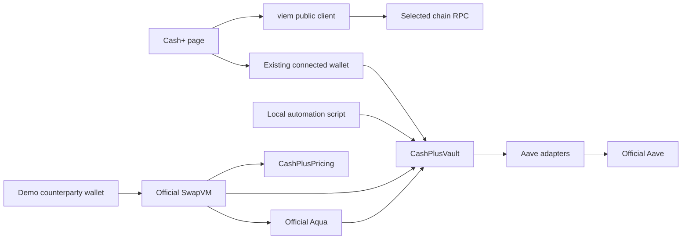

# Cash+ technical specification

> Current delivery (13 September 2026): the user selected an interactive UI-only demo, with simulated balances and no contract deployment. See [Cash+ UI demo delivery](cash-plus-ui-demo.md). The protocol requirements below are preserved as the earlier design and optional separate fork workflow; they are not claims about the mock demo.

Version 1.1 · 13 September 2026 · Dedicated-page demo scope

Target: `PoolPartyLabs/pool-party-v2-frontend`, `main` at `36d4d4c67a30f01f7d3ac656417795427c5fb4b8`.

**The latest scope is authoritative: Cash+ lives entirely on its own page, linked from the sidebar. No portfolio integration, strategy-catalog integration, new API, database or platform-backend dependency.** The page should be polished enough to lead the hackathon demonstration. It reads contracts directly and uses the existing connected wallet to sign transactions.

Read with the [contract and automation specification](cash-plus-contracts-accounting.md), [delivery and acceptance specification](cash-plus-delivery-acceptance.md). These documents form one specification. They describe proposed implementation, not completed software.

## 1. Product and scope

Cash+ is a managed investment strategy for business treasury funds. Businesses invest surplus USDC in a pooled vault. Eligible assets earn Aave interest. The pool also provides atomic stablecoin conversions using Aqua/SwapVM and retains the conversion margin.

Investor explanation: **“Your investment earns interest and a share of business conversion fees.”**

The entire investor journey is inside `/cash-plus`: understand, invest, monitor and withdraw. The technical mechanics stay in expandable details or the presenter panel. The investor does not configure orders, manage invoices or operate a trading bot.

| ID | Confirmed requirement |
|---|---|
| CP-P01 | Dedicated Cash+ page; all position data, activity and actions live there. |
| CP-P02 | Dedicated sidebar entry named exactly `Cash+`. |
| CP-P03 | Follow the existing product's visual language. |
| CP-P04 | Reuse the existing Aqua work and demonstrate a meaningful continuation. |
| CP-P05 | Automate the investment mechanism; make the product easy to explain. |
| CP-P06 | Use official Aqua/SwapVM contracts and show onchain token transfers; the supplied track rules accept local forks. |
| CP-P07 | Minimal changes to existing product; no catalog, portfolio, new API or database. |
| CP-P08 | Produce the implementation specification, not an implementation-difficulty assessment. |

### 1.1 Selected technical decisions

“MUST” means a requirement of this proposed design, not a capability already implemented.

| Topic | Decision |
|---|---|
| Demo environment | Local Arbitrum fork with official deployed Aqua/SwapVM/Aave; new Cash+ contracts on the fork. A public deployment uses its own verified manifest. |
| Investor asset | Native USDC on the selected chain. |
| Pool inventory | USDC plus one explicitly selected secondary stablecoin. Token address, issuer/representation, decimals, oracle and Aave reserve are deployment bindings. |
| Ownership | Non-transferable internal shares; no false ERC-4626 compliance claim. |
| Custody | Assets enter the pooled vault/adapters. Aqua's maker is the vault, not each investor wallet. |
| Investor transactions | Browser reads and simulates with viem, then uses the current Pool Party wallet connection to sign. |
| History | Bounded onchain event queries from deployment block, plus current snapshots. No committed array of invented fills. |
| Automation | A local CLI worker from this repo, supervised during the demo. It is not a new HTTP service. |
| Fees in this demo | No management or performance fee charged by the vault. Strategy trading costs are reflected in actual balances. Commercial fee illustrations are clearly separate. |
| Cash withdrawal | USDC only when the actual transaction simulation succeeds. |
| Alternative withdrawal | Explicit proportional exit into underlying and/or Aave receipt tokens, with separate review. |
| Deployment model | New Cash+ vault and versioned manifest; preserve Active Reserve. |
| Default fixture | A deterministic fork scenario suitable for rehearsal; simulated assumptions and executed transactions are visibly distinguished. |

The earlier product proposal of 20% performance fee on excess over Aave remains a **commercial simulation assumption**. Its high-water-mark, benchmark and investor equalization engine is not part of this narrow demo. The UI must not claim it is charged. This avoids implementing an invisible production accounting subsystem just to present the strategy.

## 2. Existing code and reuse

The inspected frontend uses Next.js 15.5.18, React 19.1, TypeScript, Tailwind 4, next-intl, Privy, wagmi, viem, React Query, Zod and decimal.js. Existing SDK pins: Aqua SDK 0.2.0, SwapVM SDK 0.3.0, sdk-core 0.1.2.

| Existing location | Reuse / adaptation |
|---|---|
| `src/components/layout/AppShell.tsx` | One new navigation item; reuse responsive shell and guarded links. |
| `src/app/globals.css` | All color, spacing, radius and typography conventions. |
| `src/features/strategies/StrategyDetailScreen.tsx` | Visual reference for content plus sticky action rail. No routing or data-model integration required. |
| `src/features/aqua/ActiveReserveScreen.tsx` | Reference for chain-read orchestration, not the final visual design. |
| `src/features/aqua/hooks/useAquaLiquidity.ts` | Reference for existing Privy/wallet handling and transaction steps. |
| `src/features/aqua/operations/aquaActions.ts` | Reference for calldata/ABI handling; Cash+ builds its own narrowly typed transactions. |
| `src/lib/aqua/api/compiler/*` | Reuse compatible SDK utilities and program concepts; do not reuse USDC/WETH band policy. |
| `src/lib/aqua/data/managerMetadata.ts` | Historical continuity evidence only; not Cash+ activity. |
| `src/lib/tx/*` | Wallet selection/execution and transaction validation helpers where they do not depend on strategy API services. |
| `src/lib/features/*` | Existing feature registry/resolver and route gating. |

The old vault at `pool-party-aqua@26b7507838539593ca14fa60228a205714281f20` already contains pooled shares, Aave placement and withdrawal during an Aqua fill. Cash+ adds stablecoin inventory, deterministic policy/pricing, aggregate exposure protection, automation and a dedicated investor experience.

The existing `Strategy` and `Position` models contain Uniswap fields. **Leave those models unchanged.** Cash+ owns local types. It does not need fake ticks, NFT IDs, catalog UUIDs or generic portfolio actions.

The installed Aqua SDK builder does not expose all instructions of the inspected SwapVM v1.0.2 Aqua opcode table. In particular, `AquaProgramBuilder` in SDK 0.3.0 lacks `extruction`, although the pinned official router source includes it. A versioned narrow encoder and compiler parity tests are required. The regular builder must not be substituted blindly because opcode maps differ.

## 3. Minimal architecture



There is no new REST/GraphQL API, indexer service, database, backend login integration or server-held investor key. The current app's authentication and wallet providers remain in place. Chain ownership comes from the signing wallet and contract `msg.sender`.

Public onchain reads are public data. A user-supplied address can select a public read but cannot authorize a write. The page defaults to the current connected wallet and does not accept `?investor=` as an alternative signing identity. Switching wallets clears all private UI state and amount forms.

Continuous automation cannot reliably run inside an inactive browser tab or a Next request. It runs as `pnpm cash-plus:keeper` in a terminal during the demo. Local scripts contain all presenter actions that require a manager/counterparty key. Nothing is exposed as an unauthenticated web endpoint.

Contracts remain in a companion Solidity workspace, proposed as `pool-party-aqua/contracts`. The frontend imports generated ABI artifacts and a public manifest. A page alone cannot provide onchain accounting or new settlement controls.

## 4. Page and visual specification

### 4.1 Route and navigation

Canonical path: `src/app/[locale]/(auth)/(app)/cash-plus/page.tsx`.

Add a thin route file, `loading.tsx`, `error.tsx` and a client `CashPlusScreen`. Put the sidebar entry immediately after Strategies, without adding a card to Strategies. Use the existing `GuardedLink`, active state, collapsed tooltip and icon dimensions. Extend the typed nav label lookup with `nav.cashPlus`; the product name is invariant across locales.

On mobile, include Cash+ in the existing responsive navigation surface. If the shell only exposes bottom tabs at that breakpoint, add a Cash+ item to that mobile array behind the same feature flag and verify the five/six-item layout at 360px. Do not create a shared Strategies/Portfolio subnavigation. If the existing mock Cards item would produce six items, suppress that mock-only Cards entry while Cash+ is enabled in the demo configuration. Preserve live core destinations.

### 4.2 Visual language

Use semantic classes from the existing theme. Reference colors below describe the current code, not a parallel theme definition.

| Element | Existing visual |
|---|---|
| Canvas / card / raised | `#171717` / `#1f1f1f` / `#2a2a2a` |
| Foreground / muted / border | `#efefef` / `#a3a3a3` / `#333333` |
| Main accent | Pool Party gold `#f7ce02` |
| Success / error / focus | `#22c55e` / `#fc3c25` / `#3b82f6` |
| Type | Poppins 400/500/600/700; existing mono treatment for technical numbers |
| Shell | 64px header; 256px expanded / 76px collapsed sidebar |
| Content | Existing max-width 1280px; shell padding 16px, 24px at lg |
| Layout | Desktop 2:1 main/action columns, 24px gap; mobile one column |
| Cards | Existing rounded-xl, border-border, bg-surface, p-5/p-6 |

Do not copy the older Aqua page's blue-gradient treatment. Cash+ should look like an intentional part of today's Pool Party product. It should not look like an embedded analytics dashboard or developer console.

### 4.3 First viewport, the demo's main frame

Desktop arrangement:

```text
Cash+                                  Arbitrum · Demo on a local fork
Your investment earns interest and a share of business conversion fees.

┌─────────────────────────────────────────┬──────────────────────────┐
│ MY INVESTMENT       RESULT              │ Invest in Cash+          │
│ $100,000.00         +$12.34              │ [ USDC amount          ] │
│ Current actual position, clear period   │ Available balance        │
│                                         │ [ Invest ]               │
│ [Value / Return]   [period control]      │ [ Withdraw ] if invested │
│ Observed chart or honest empty state    │ Capacity and liquidity   │
├─────────────────────────────────────────┴──────────────────────────┤
│ Interest                 Conversion result          Available cash│
├────────────────────────────────────────────────────────────────────┤
│ How your money works: Earn interest → Convert → Earn fees          │
│ Actual status: Lending active / Last conversion / Exposure         │
├────────────────────────────────────────────────────────────────────┤
│ Activity                      Composition / Strategy details       │
└────────────────────────────────────────────────────────────────────┘
```

The numbers in this wireframe are layout placeholders, not values to hardcode in real mode. The primary number always comes from the connected wallet's onchain shares and current NAV.

For an uninvested wallet, replace “My investment” with a short strategy explanation and the available capacity; the invest action remains prominent. Avoid showing an unexplained $0 hero during loading.

### 4.4 Components and visual behavior

| Component | Behavior |
|---|---|
| `CashPlusHero` | Cash+ name, concise description, network and honest demo/live status. Use existing StrategyLogo/monogram treatment. |
| `CashPlusPositionCard` | Position value, principal paid in, result and current withdrawal estimate. Privacy masking follows the app setting. |
| `CashPlusInvestPanel` | Exact USDC amount, Max, wallet balance, capacity, primary CTA and contextual Withdraw. |
| `CashPlusChart` | Current observed share-value history from events/current reads. One point means an empty-history state, not a synthetic curve. |
| `CashPlusReturnSources` | Lending vs conversions, with inventory valuation/cost explanation expandable. No unsupported precision. |
| `CashPlusFlow` | Three clear stages with subtle status animation: interest, conversion, result. It changes only after real state/receipt changes. |
| `CashPlusActivity` | Deposits, conversions, lending movements and withdrawals, with amounts, time and explorer/receipt access. |
| `CashPlusComposition` | Underlying token/issuer exposure and percentage; Aave is a placement breakdown, not another asset counted twice. |
| `CashPlusDetails` | Fees, liquidity, risks and contract addresses in accordions. |
| `CashPlusSimulation` | Separate collapsed “Illustrative comparison” with adjustable assumptions and a persistent simulation label. |
| `CashPlusDemoPanel` | Presenter-only explanation of the next CLI step and observed transaction; no browser private keys or hidden fake success buttons. |

Use `Card`, `Button`, `MetricTile`, `PerformanceChart`, `Sheet`, `TransactionModalHeader`, token rows, receipt rows, skeletons and error states already available. Some transaction components are private to another feature; either reuse public shared primitives or make a small Cash+-local composition. Avoid a broad extraction/refactor of the existing strategy flow for this demo.

Investment/withdrawal uses the existing Sheet behavior: focus management, desktop side panel/mobile bottom sheet, input → review → wallet → pending → result. Large numbers, short labels and visible actions carry the presentation. Raw addresses and full mechanics belong in details.

Motion: use the existing motion library, 150–250ms transitions, subtle new-activity highlight and numeric transitions only after confirmed reads. No looping “earning” animation that implies guaranteed returns. Respect reduced motion.

### 4.5 States and responsive details

| State | Required presentation |
|---|---|
| Loading | Stable skeleton; no demonstration values injected into real reads |
| Wallet disconnected | Existing connect flow and read-only strategy overview |
| No shares | Invest-focused empty position |
| Active | Current position, activity and available actions |
| Capacity reached | Disable Invest, explain capacity; Withdraw remains available |
| Trading paused | Show “Conversions paused”; lending data remains accurate |
| Wrong chain | Current app's network-switch action, then fresh read/simulation |
| Stale/unavailable read | Last-good timestamp or unavailable state; no numeric zero substitution |
| Limited cash liquidity | Executable USDC estimate plus separate proportional-exit choice |
| Pending tx | Hash/receipt link and clear stage; no success before receipt |
| Confirmed tx | Actual amounts from receipt; refresh page state |
| Oracle/sequencer issue | Priced operations unavailable; explain recovery option if supported |

At 360/390px: single column, amount/actions before charts, no horizontal overflow, enough clearance above bottom navigation. At 1024/1440px: 2:1 columns and sticky action rail below existing header. Keyboard, labels, focus restoration, screen-reader status updates and non-color status cues are required.

### 4.6 Copy and localization

Use `cashPlus.json` in the existing next-intl structure, loaded in `src/i18n/request.ts`; add `nav.cashPlus` in `shell.json`. The repository has 11 locales: en, pt-BR, es, fr, de, nl, ja, ko, zh-CN, zh-TW and vi. Preserve namespace completeness; English is canonical, with polished English and pt-BR demo copy. No raw errors or em dashes in product copy.

Suggested English/PT-BR pairs:

| English | PT-BR |
|---|---|
| Invest in Cash+ | Investir no Cash+ |
| My investment | Meu investimento |
| Result since investing | Resultado desde a aplicação |
| Available to withdraw | Disponível para resgate |
| Interest earned | Juros acumulados |
| Conversion result | Resultado das conversões |
| Conversions paused | Conversões pausadas |
| Illustrative comparison | Comparação ilustrativa |
| Receive the pool's assets | Receber os ativos do pool |

## 5. Local data model and reads

Cash+ models live in `src/lib/cash-plus`, independent of the app's generic Strategy/Position types.

```ts
type RawAmount = string; // decimal integer, uint256-safe
type SnapshotRef = {
  chainId: number;
  vault: `0x${string}`;
  blockNumber: string;
  blockHash: `0x${string}`;
  timestamp: string;
  readAt: string;
  status: "fresh" | "stale" | "unavailable";
};

type CashPlusSnapshot = {
  ref: SnapshotRef;
  totalAssetsUsdcRaw: RawAmount | null;
  totalSharesRaw: RawAmount;
  depositHeadroomUsdcRaw: RawAmount | null;
  walletUsdcRaw: RawAmount | null;
  lending: Array<{ token: string; underlyingRaw: RawAmount; indexRay: RawAmount }>;
  inventory: Array<{ token: string; totalRaw: RawAmount; weightBps: number | null }>;
  depositsPaused: boolean;
  tradingPaused: boolean;
  oracleHealthy: boolean;
};

type CashPlusAccount = {
  owner: `0x${string}`;
  sharesRaw: RawAmount;
  claimUsdcRaw: RawAmount | null;
  depositedUsdcRaw: RawAmount;
  withdrawnUsdcEquivalentRaw: RawAmount | null;
  resultUsdcRaw: string | null; // signed
  cashExitEstimateUsdcRaw: RawAmount | null;
  ref: SnapshotRef;
};
```

Use bigint for balances, shares, transaction values and limits. Use decimal.js for simulation arithmetic. No JS number path into calldata. Number conversion is allowed only at the final chart/render boundary after range checks. Decimal input forbids exponent notation and excess token precision; localized separators are handled intentionally.

### 5.1 Query implementation

`useCashPlusSnapshot`, `useCashPlusAccount` and `useCashPlusActivity` use the existing React Query provider. Key format includes mode, chain, vault, connected owner where applicable and schema version. Read a common block with multicall where supported. RPC errors remain errors or null-with-status, never successful zero balances.

Visible-page polling defaults to 10 seconds for the demo, stops in background, backs off on 429/provider failures and refreshes immediately after receipts. Aggregate parallel reads into one multicall. Keep no more than one active refresh per query key. Demo scripts must not hammer the same public RPC in parallel.

Latest state is authoritative for previews. A displayed balance older than 30 seconds triggers a refresh before review. The final operation is always simulated again. No numerical read TTL guarantees that liquidity will remain available until inclusion.

For cash availability, first simulate the full account redemption. If it fails for liquidity, show partial-liquidity status and allow amount-specific simulation. An optional bounded search may try at most four smaller candidates; label the largest successful candidate as an estimate, not the exact maximum. Do not run a binary search on every polling cycle or interpret unrelated simulation errors as a liquidity limit.

### 5.2 Onchain history without an indexer

Fetch relevant vault/router events from `manifest.deploymentBlock` to a pinned tip. Use adaptive block ranges, a bounded concurrency of one or two, and event deduplication by chain + block hash + tx hash + log index. The demo manifest has a recent deployment block; never scan the chain from genesis.

Keep cache in memory for the session, with a bounded recent-event list. Reload performs a fresh bounded replay. For a deployment with history exceeding the configured event/range budget, show a truthful partial-history state and a “Load earlier” action, not an infinite blocking scan or invented totals.

Store cumulative account deposits/withdrawals in the vault so the position summary does not require unbounded event replay. Events feed the timeline and checkpoint chart. Verify cached block hashes over a recent reorg window; discard orphaned events and refetch. A local fork reset changes manifest run ID/cache namespace and clears old UI data.

Chart checkpoints come from contract `StateCheckpoint` events plus a current read. Label the period accurately. Do not calculate a publishable APY from minutes of demo data. A short demo can show exact interest change after controlled fork time advancement, clearly labeled as a time-advanced test.

### 5.3 Attribution

Account result = current claim + cumulative withdrawal value − cumulative deposited USDC. Because there are no investor-level fees in this contract version, this is the result before any proposed commercial performance fee. Do not label it “net after all fees.”

Lending attribution uses adapter scaled balances/reserve indices around recorded operations. Conversion result uses actual input/output amounts at the same validated price snapshot. Inventory price changes and rebalance costs are separate. If full reconciliation is unavailable, show total actual result and mark the breakdown incomplete; do not force unexplained differences into “fees earned.”

USDC-denominated accounting and USD display are separate. If USDC departs from $1, use the USD feed for display or label values in USDC. Aqua virtual balances are neither extra assets nor locked capital.

## 6. Transactions, security and recovery

### 6.1 Direct wallet flow

1. Resolve the current app wallet and required chain.
2. Read manifest-bound contracts, amount constraints and allowance.
3. Build typed calldata locally from generated ABI.
4. Simulate with the actual owner as `account`.
5. Present a review with amount, minimum receive/shares, network, gas estimate and liquidity conditions.
6. Validate the transaction against that reviewed intent.
7. Request the existing wallet signature and broadcast.
8. Wait for a successful receipt, decode expected vault events and refresh reads at/after the receipt block.

There is no new transaction-building API. Do not use the locally decoded session JWT as security authority. Onchain `msg.sender` and the connected signer govern ownership. Server-only Aqua compiler code stays in CLI scripts and is not imported into the browser bundle.

### 6.2 Deposit

Input is USDC. Max is `min(successfully read wallet balance, capacity headroom)`. ETH gas readiness is separate. Failed reads must not fall back to capacity.

Approve exact USDC amount to the Cash+ vault if allowance is insufficient. Re-read after approval and re-simulate deposit. Deposit includes `minShares`, deadline and expected policy version. A changed wallet, network, amount or material preview returns to review. No implicit bridge, swap, Permit2 or unlimited approval.

Receipt proof: correct vault, owner, USDC amount and shares. Depositing never immediately fabricates a conversion or interest payment.

### 6.3 Withdrawal

UI accepts a desired approximate USDC amount, translates it to exact shares, and reviews estimated USDC output plus minimum output. “All” reads the latest share balance and uses `redeemAll`; fee settlement is absent in this version. Availability must be tested by simulating the real redemption, including Aave withdrawal. An aToken balance is not proof of immediately withdrawable underlying.

Do not automatically execute a swap to cover unavailable USDC, reduce an approved amount or create a queue. Offer a lower amount or the distinct proportional-exit sheet. A proportional exit displays each asset, quantity and receipt-token limitation; it is not called cash withdrawal.

### 6.4 Local operation state

`input → preflight → review → approval? → revalidate → signature → submitted → confirmed → refreshed`.

Persist only a minimal pending-operation journal in session storage: mode/run ID, owner, chain, vault, operation ID, intent hash, nonce and tx hash. No keys/tokens. A sent transaction is not resent because polling timed out. Handle replacement/cancellation and account switch explicitly.

Before signature, verify mandatory chain ID, owner, value zero, exact target, allowed selector, spender, amount, receiver, minimums, policy and expiry. No generic multicall, extra target or arbitrary call sequence. Validate the real decoded calldata, not just a display object.

Error codes: `WRONG_NETWORK`, `WALLET_CHANGED`, `AMOUNT_INVALID`, `READ_UNAVAILABLE`, `INSUFFICIENT_USDC`, `INSUFFICIENT_GAS`, `CAPACITY_FULL`, `DEPOSIT_PAUSED`, `TRADING_PAUSED`, `ORACLE_INVALID`, `SEQUENCER_UNAVAILABLE`, `LIQUIDITY_INSUFFICIENT`, `MIN_OUTPUT_NOT_MET`, `POLICY_CHANGED`, `QUOTE_EXPIRED`, `USER_REJECTED`, `TX_REVERTED`, `TX_REPLACED`, `HISTORY_PARTIAL`. Map to short localized messages; preserve a diagnostic ID in details.

## 7. Demonstrating commercial value honestly

Keep two clearly separated elements on the same page:

1. **Actual demo result:** token transfers, shares, current position, lending and realized conversion evidence from the selected chain/fork.
2. **Illustrative annual comparison:** editable assumptions showing the proposed business economics. The calculator never feeds actual balance, activity or APY components.

Default comparison fixture, matching the product report:

| Annual assumption | Value |
|---|---:|
| Average NAV | $1,000,000 |
| Average lending allocation / lending rate | 95% / 4% |
| External annual conversion volume | $40,000,000 |
| Gross margin / variable costs | 5 bps / 2 bps |
| Fixed additional costs | $4,000 |
| Illustrative performance fee | 20% of positive excess over $40,000 Aave reference |

`interest = NAV × lendingAllocation × lendingRate`

`prePerformanceResult = interest + volume × (grossBps − variableBps)/10000 − fixedCosts`

`fee = max(prePerformanceResult − NAV × benchmarkRate, 0) × 20%`

`investorResult = prePerformanceResult − fee`

Result: $44,800 / 4.48%, versus $40,000 / 4%; +0.48 percentage point and 12% more dollars of return. At $10m volume: 3.70%; at zero volume: 3.40%. These are annual simple illustrations, before taxes, individual funding/exit costs and extraordinary losses. They are not actual demo yield or an unconditional “up to” claim.

Time comparison: applying to Aave is already simple. Explain the automated work being delegated, quoting, inventory control and Aave management, but do not invent hours saved. The demo proves automation through actual transitions. It does not establish recurring external demand; the counterparty is a test participant.

## 8. Flags, configuration and product impact

Register `cashPlus` in the current feature registry, default false, stage `next`, with `NEXT_PUBLIC_FEATURE_CASH_PLUS`. Add the literal resolver branch, nav flag, route guard, env example and tests. The flag controls discovery; it is not an onchain pause.

No portfolio recovery path is needed because all Cash+ functions remain on this page. During a funded demo/public deployment, keep the route accessible while disabling new investments through onchain status. Hiding the nav must not be the operational response to an incident. A permanently disabled funded route must still have a documented direct contract exit path.

Modes:

- `preview`: local deterministic fixtures for visual development; cannot request wallet sends; prominent preview label.
- `fork`: genuine fork transactions and reads, explicit local chain/run ID; no production keys.
- `live`: manifest-bound public deployment; never falls back to fixtures when RPC fails.

Configuration: public mode/deployment ID/manifest, selected chain RPC according to existing app conventions, feature flag; CLI-only RPC and signer references. Browser RPC endpoints cannot contain private bearer secrets. If the existing app has a shared RPC transport, reuse it rather than adding a Cash+ proxy/API. Public RPC quota or local RPC is sufficient for the demo.

The keeper, seed and counterparty keys stay only in local CLI environment/KMS references. Never use `NEXT_PUBLIC_*`, check in an `.env`, or import CLI signer code into the client.

### 8.1 Files to create

```text
src/app/[locale]/(auth)/(app)/cash-plus/page.tsx
src/app/[locale]/(auth)/(app)/cash-plus/loading.tsx
src/app/[locale]/(auth)/(app)/cash-plus/error.tsx
src/features/cash-plus/CashPlusScreen.tsx
src/features/cash-plus/components/
  CashPlusHero.tsx, CashPlusPositionCard.tsx, CashPlusInvestPanel.tsx
  CashPlusChart.tsx, CashPlusReturnSources.tsx, CashPlusFlow.tsx
  CashPlusActivity.tsx, CashPlusComposition.tsx, CashPlusDetails.tsx
  CashPlusInvestSheet.tsx, CashPlusWithdrawSheet.tsx, CashPlusExitSheet.tsx
  CashPlusSimulation.tsx, CashPlusDemoPanel.tsx
src/features/cash-plus/hooks/
  useCashPlusSnapshot.ts, useCashPlusAccount.ts, useCashPlusActivity.ts
  useCashPlusInvest.ts, useCashPlusWithdraw.ts
src/lib/cash-plus/
  types.ts, schemas.ts, amounts.ts, errors.ts, client.ts
  readSnapshot.ts, readAccount.ts, readActivity.ts, receipts.ts
  buildTransaction.ts, validateIntent.ts, pendingOperation.ts
  comparison.ts, attribution.ts, demoFixtures.ts
  config/deployments.ts, abi/ [generated]
scripts/cash-plus/
  deploy-fork.ts, export-artifacts.ts, verify-deployment.ts
  compile.ts, keeper.ts, counterparty.ts, demo.ts
src/i18n/messages/{locale}/cashPlus.json
docs/features/cash-plus/ [specs, demo runbook and manifest]
```

### 8.2 Existing files to modify

AppShell navigation; feature registry/resolver; namespace loader and localized shell label; `.env.example`; `package.json` CLI commands; integration/IDs registry and feature docs. Reuse existing chain configuration where possible; if a local fork chain is absent, add only that demo network configuration behind explicit mode.

**Do not modify** StrategyCard/catalog mappings, generic Strategy/Position schemas, portfolio/Home aggregations, platform API contracts, generic services or existing Active Reserve deployment constants. This is an architectural boundary, not a suggestion to hide a backend dependency elsewhere.

## 9. Evidence and implementation status

The inspected source includes shell/design tokens, Aqua hooks/actions/compiler, transaction helpers, original contracts/adapters and official SwapVM v1.0.2. The local dependency installation succeeded. Browser capture timed out during development compilation and emitted missing optional dependency warnings, so the visual specification is grounded in source components/tokens, not a claimed completed screenshot review. No Cash+ source implementation, test suite execution, audit or deployment is claimed here.

Pinned references:

- [Frontend](https://github.com/PoolPartyLabs/pool-party-v2-frontend/tree/36d4d4c67a30f01f7d3ac656417795427c5fb4b8)
- [AppShell](https://github.com/PoolPartyLabs/pool-party-v2-frontend/blob/36d4d4c67a30f01f7d3ac656417795427c5fb4b8/src/components/layout/AppShell.tsx)
- [Strategy visual reference](https://github.com/PoolPartyLabs/pool-party-v2-frontend/blob/36d4d4c67a30f01f7d3ac656417795427c5fb4b8/src/features/strategies/StrategyDetailScreen.tsx)
- [Existing Aqua compiler](https://github.com/PoolPartyLabs/pool-party-v2-frontend/blob/36d4d4c67a30f01f7d3ac656417795427c5fb4b8/src/lib/aqua/api/compiler/compile.ts)
- [Original vault](https://github.com/0xmvercosa/pool-party-aqua/blob/26b7507838539593ca14fa60228a205714281f20/contracts/src/PartyVault.sol)
- [Original adapter](https://github.com/0xmvercosa/pool-party-aqua/blob/26b7507838539593ca14fa60228a205714281f20/contracts/src/AaveV3Adapter.sol)
- [Official Aqua opcode table](https://github.com/1inch/swap-vm/blob/32c687c2b73101fc26549e48fa1ff8a4d73afbac/src/opcodes/AquaOpcodes.sol)
- [Official Extruction interface](https://github.com/1inch/swap-vm/blob/32c687c2b73101fc26549e48fa1ff8a4d73afbac/src/instructions/Extruction.sol)
